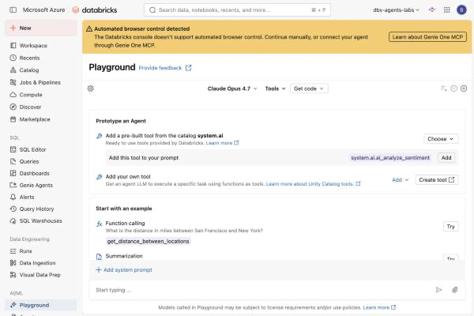
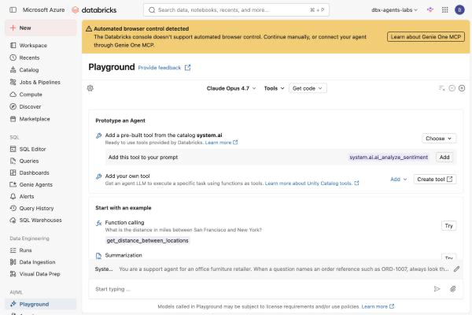
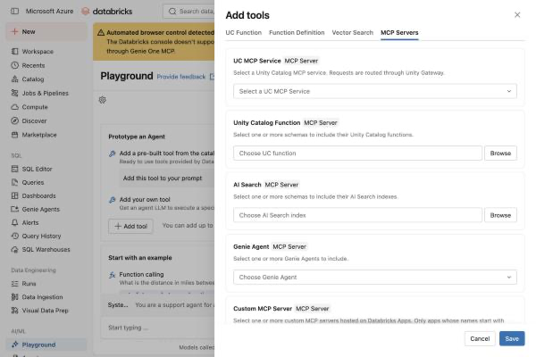
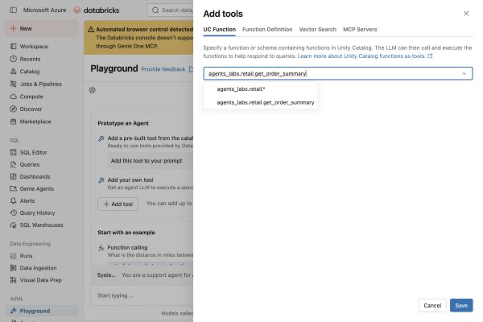
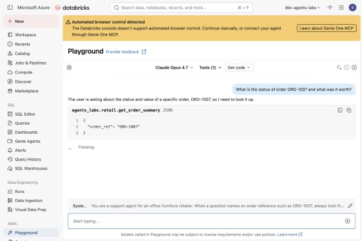
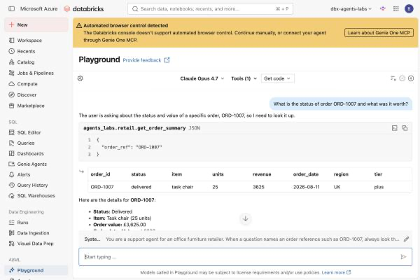
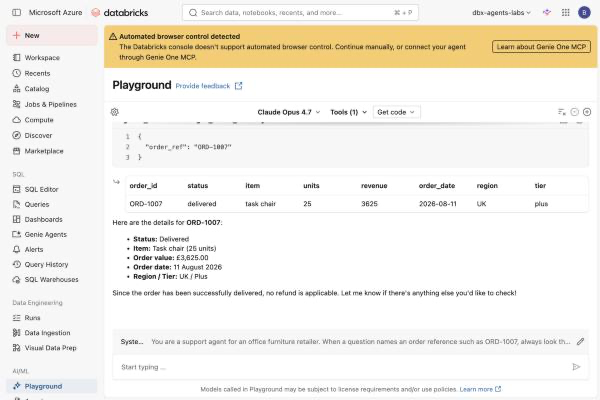
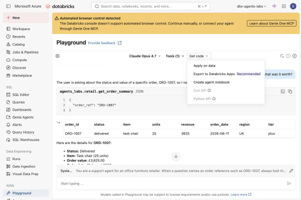

# Lab 1C — Build Your First Agent in the Databricks UI

**Session:** 1 — Agent Architecture
**Duration:** ~45 minutes
**Tool:** Databricks AI Playground
**Writes code:** none — you leave this lab with a generated notebook you did not type

> **UI verified on 2026-09-30** in a live Azure Databricks workspace (Premium SKU, `eastus`).
> Every label quoted here was read off the screen, not from documentation. The Databricks
> console changes often — walk it once yourself before teaching.

---

## 1. Lab Overview & Objectives

[Lab 1A](lab-1a-workflow-vs-agent.md) decided *whether* to build an agent. [Lab 1B](lab-1b-minimal-agent.md) builds one in plain Python so the loop has no magic in it.

This lab builds the same thing **without writing a line of code**, in the Databricks AI Playground, and then presses one button that turns it into a notebook. That notebook is where Sessions 3 through 6 actually live — so this lab is the front door to the rest of the course.

**By the end of this lab you will be able to:**

1. Attach a **Unity Catalog function as a tool** from a dropdown, and explain why its `COMMENT` is the tool description the model reads.
2. Write a system prompt in the Playground and know what it becomes in generated code.
3. Read a tool call in the Playground — the arguments the model chose and the rows that came back.
4. Export the prototype with **Get code → Create agent notebook**, and name the seven `TODO`s it leaves you.

> **The finding worth the session:** the export is not a toy. It generates a **463-line notebook** that authors an MLflow `ResponsesAgent`, evaluates it with Mosaic AI Agent Evaluation, logs it to Unity Catalog and deploys it to Model Serving. It is the whole of Sessions 3–6 in one file. The skill this course teaches is not typing that file — it is **knowing which of its defaults are wrong for you**.

---

## 2. Files You Will Use

**None to start with.** This lab is entirely in the Databricks console — that is the point
of it.

| # | What | Where | When |
|---|---|---|---|
| 1 | **AI Playground** | left navigation → **AI/ML** → **Playground** | the whole lab |
| 2 | `agents_labs.retail.get_order_summary` | Unity Catalog | attached as a tool in Step 3 |
| 3 | **`Agent <model> <timestamp>/driver`** | *created by Step 5* | a **463-line notebook** you did not type |
| 4 | [`artifacts/lab-1c/evidence/playground-generated-driver.py`](../artifacts/lab-1c/evidence/playground-generated-driver.py) | this repo | that generated notebook, saved, so you can read it before running it |

> 💡 **You finish this lab with a file you did not write.** Step 5 exports your prototype
> as a notebook that authors a `ResponsesAgent`, evaluates it, registers it and deploys it.
> Keep it — it is the same shape as the notebooks in Sessions 3 through 6.

---

## 3. Prerequisites

- A Databricks workspace on **Premium or Enterprise**. The Playground itself runs on a trial, but **Get code → Create agent notebook** leads to logging and deployment steps that a trial refuses.
- **Unity Catalog set up**, with the `agents_labs.retail` catalog and schema from the course setup.
- The `get_order_summary` function from [Lab 5A](../session-5-tools-and-governance/lab-5a-governed-uc-function.md). If you are running the course in order, create it now — it is one `CREATE FUNCTION` statement in [`tools/setup/05_uc_functions.sql`](../tools/setup/05_uc_functions.sql).
- `USE CATALOG`, `USE SCHEMA` and `EXECUTE` on that function. **Without `EXECUTE` the function does not appear in the picker at all** — it is not greyed out, it is simply absent, which reads like the function does not exist.
- A browser at 100% zoom, window 1280px or wider.

> ### ⚠️ The Playground bills per call, and per model
>
> Every message is a Foundation Model API call against the selected endpoint. The default in
> this workspace was **Claude Opus 4.7** — a large model. A room of 20 learners each sending
> 15 messages is 300 calls against a premium endpoint.
>
> Switch the model selector to a smaller endpoint for the teaching run if cost matters. The
> lab works identically on `databricks-claude-sonnet-5`; only the latency and the bill change.

---

## 4. What You're Building

```
  Databricks AI Playground — "Prototype an Agent"
  ────────────────────────────────────────────────────────────────

  SYSTEM PROMPT                     TOOLS
  ┌──────────────────────────┐      ┌───────────────────────────────┐
  │ You are a support agent  │      │ agents_labs.retail            │
  │ ...                      │◄────►│   .get_order_summary          │
  │ always look the order up │      │                               │
  │ with your tool rather    │      │ signature  = the tool schema  │
  │ than guessing            │      │ COMMENT    = the description  │
  │ Never invent an order    │      │ GRANT      = the access check │
  └──────────────────────────┘      └───────────────────────────────┘
              │
              ▼
  ┌──────────────────────────────────────────────────────────────┐
  │  THE TEST                                                     │
  │                                                               │
  │  ASK    "What is the status of order ORD-1007 and what was    │
  │          it worth?"                                           │
  │                                                               │
  │  WATCH  1. the model emits {"order_ref": "ORD-1007"}          │
  │         2. the real row comes back from Unity Catalog         │
  │         3. the answer is built FROM that row                  │
  └──────────────────────────────────────────────────────────────┘
              │
              ▼
        Get code → Create agent notebook
              │
              ▼
        463 lines · 7 TODOs · Sessions 3–6
```

---

## 5. Step-by-Step Instructions

### Step 1 — Open the Playground (3 min)

**Why:** The Playground is the only place in Databricks where you can attach a tool, send a message and watch the tool call, without any setup.

1. In the left-hand navigation, scroll to the **AI/ML** section.
2. Click **Playground**.



**Expected result:** a page headed **Playground**, with a model selector in the top bar (showing `Claude Opus 4.7` in this workspace), a **Tools** dropdown, a **Get code** dropdown, and a **Prototype an Agent** panel offering two routes — *Add a pre-built tool from the catalog `system.ai`* and *Add your own tool*.

> **Read the top bar left to right — it is the whole agent.** Model, Tools, Get code. An agent in Databricks is a model, plus tools, plus the code that loops between them. The Playground exposes exactly those three things and nothing else.

---

### Step 2 — Write the system prompt (8 min)

**Why:** The system prompt is where judgement lives. The tool tells the agent what it *can* find out; the prompt tells it when it *must*.

1. Below the examples, click **+ Add system prompt**.
2. A **System Prompt:** field appears, placeholder *"Optionally override the system prompt."*
3. Enter:

   ```
   You are a support agent for an office furniture retailer. When a question names an
   order reference such as ORD-1007, always look the order up with your tool rather
   than guessing. State the order status, the item and the refund value. Never invent
   an order.
   ```

4. Click **Save**. (There is also **Reset** and **Cancel** — `Cancel` discards, `Reset` returns to the default.)



**Expected result:** the prompt appears on a truncated **`Syste…`** line directly above the message box, with a pencil icon to re-edit it.

**Why each clause earns its place:**

| Clause | What it prevents |
|---|---|
| *always look the order up with your tool* | The model answering from the order reference's *shape* instead of the data |
| *rather than guessing* | A plausible invented status — the failure that is hardest to spot |
| *State the order status, the item and the refund value* | An answer that omits the number the human actually needed |
| *Never invent an order* | A confident answer for `ORD-9999`, which does not exist |

> **The prompt is not a safety control.** It is an instruction the model usually follows. [Lab 7B](../session-7-operations-and-multi-agent/lab-7b-rollout-and-agent-bricks.md) Step 3 measures how "usually" behaves: a behaviour asked for in a prompt showed up in **2 runs out of 3**. Anything that must happen every time belongs in code, not here — which is [Lab 1B](lab-1b-minimal-agent.md)'s approval gate.

---

### Step 3 — Attach the Unity Catalog function as a tool (10 min)

**Why:** This is the step that makes it an agent rather than a chatbot.

1. In the **Prototype an Agent** panel, find **Add your own tool** — *"Get an agent LLM to execute specific task using functions as tools."*
2. Click **Add**. A **+ Add tool** button appears, with the note *"You can add up to 20 tools"*.
3. Click **+ Add tool**. The **Add tools** dialog opens on four tabs: **UC Function**, **Function Definition**, **Vector Search**, **MCP Servers**.



**Look at the MCP Servers tab before you leave it.** It offers **UC MCP Service**, **Unity Catalog Function**, **AI Search**, **Genie Agent** and **Custom MCP Server**. Every governed thing in this course is reachable from here as an MCP tool — the functions from [Lab 5A](../session-5-tools-and-governance/lab-5a-governed-uc-function.md), the index from [Lab 3A](../session-3-grounding-and-rag/lab-3a-vector-search-index.md), the Genie space from [Lab 4A](../session-4-genie/lab-4a-genie-space.md). [Lab 5B](../session-5-tools-and-governance/lab-5b-mcp-and-access-control.md) does this from the command line; this dialog is the same thing with a mouse.

4. Click the **UC Function** tab.
5. Click **Add hosted function** and type `agents_labs.retail.get_order_summary`.



**Two options appear, and the difference matters:**

| Option | Meaning |
|---|---|
| `agents_labs.retail.*` | **every** function in the schema becomes a tool — including ones added later |
| `agents_labs.retail.get_order_summary` | exactly this one |

6. Choose the **specific function**, then click **Save**.

**Expected result:** the top bar now reads **Tools (1)**.

> ### ⚠️ The wildcard is a standing grant, not a shortcut
>
> `agents_labs.retail.*` looks like convenience and behaves like policy. The agent's tool list
> becomes *whatever that schema contains at call time*, so a colleague adding a function next
> month silently hands your agent a new capability, with no review and no redeploy.
>
> Use the wildcard when the schema **is** the agent's toolbox and is governed as such. Name
> functions explicitly when the agent is meant to do one job. This is the same argument as
> `SELECT *` in a view, with a larger blast radius.

> **You did not write a tool description.** The model decides whether to call this function by
> reading the function's Unity Catalog `COMMENT` — *"Look up one order: fulfilment status, item,
> units, revenue, and the region and loyalty tier…"*. The signature became the parameter schema
> and the `COMMENT` became the description. **An undocumented function makes a bad tool**, and
> the fix is `COMMENT ON FUNCTION`, not prompt engineering. [Lab 5A](../session-5-tools-and-governance/lab-5a-governed-uc-function.md) is this claim in detail.

---

### Step 4 — Test it, and watch the tool call (10 min)

**Why:** The reason to prototype here rather than in code is that the Playground shows you the middle of the loop, not just the answer.

1. Click the message box (*"Start typing …"*).
2. Ask:

   ```
   What is the status of order ORD-1007 and what was it worth?
   ```

3. Press **Enter**.



**Expected result, in three visible stages.** First the model states its intent and emits the call:

```
  The user is asking about the status and value of a specific order, ORD-1007,
  so I need to look it up.

  agents_labs.retail.get_order_summary   JSON
    1  {
    2    "order_ref": "ORD-1007"
    3  }
```

Then the real row returns from Unity Catalog, rendered as a table:



| order_id | status | item | units | revenue | order_date | region | tier |
|---|---|---|---|---|---|---|---|
| ORD-1007 | delivered | task chair | 25 | 3625 | 2026-08-11 | UK | plus |

And then the answer is built from that row:



> Here are the details for **ORD-1007**:
> - **Status:** Delivered
> - **Item:** Task chair (25 units)
> - **Order value:** £3,625.00
> - **Order date:** 11 August 2026
> - **Region / Tier:** UK / Plus
>
> Since the order has been successfully delivered, no refund is applicable.

**What to point at, in this order:**

1. **The arguments are the model's choice.** Nothing parsed `ORD-1007` out of the sentence with a regex. The model read the function signature and decided what `order_ref` should be. That is the difference between a workflow and an agent, and it is [Lab 1A](lab-1a-workflow-vs-agent.md)'s whole argument, visible in three lines of JSON.
2. **The table is real.** Those are rows from Unity Catalog, under your grants, in your governed catalog.
3. **The last sentence is not in the table.** *"Since the order has been successfully delivered, no refund is applicable"* is the model reasoning over the row. It happens to be right. **Nothing checked it**, and that is what Session 6 exists to measure.

**Now break it.** Ask for an order that does not exist:

```
What is the status of order ORD-9999?
```

The system prompt's *"Never invent an order"* is the only thing standing between you and a confident fabrication. Watch whether it holds — and note that you are testing it *once*.

---

### Step 5 — Export it to a notebook (10 min)

**Why:** This is the step that connects this lab to the rest of the course.

1. In the top bar, click **Get code**.



The menu offers five routes:

| Option | What it gives you |
|---|---|
| Apply on data | run the prompt across a table |
| Export to Databricks Apps *(Recommended)* | a hosted chat UI |
| **Create agent notebook** | **the full agent lifecycle as code** |
| Curl API | one shell command |
| Python API | one snippet |

2. Click **Create agent notebook**.

**Expected result:** a new folder in your workspace home, named `Agent <model> <timestamp>`, containing a notebook called **`driver`**. It opens in a new browser tab.

> ⚠️ **It opens in a pop-up.** If your browser blocks pop-ups the notebook is still created — look in your workspace home for the `Agent …` folder. It will not appear in *Recents* until you open it.

**What you were handed.** Open `driver` and read it before running anything:

```
  463 lines · 7 TODOs

  %pip install backoff databricks-openai uv databricks-agents mlflow-skinny[databricks]

  LLM_ENDPOINT_NAME = "databricks-claude-opus-4-7"

  SYSTEM_PROMPT = """You are a support agent for an office furniture retailer. When a
  question names an order reference such as ORD-1007, always look the order up with your
  tool rather than guessing. …"""

  UC_TOOL_NAMES = ["agents_labs.retail.get_order_summary"]
  uc_toolkit = UCFunctionToolkit(function_names=UC_TOOL_NAMES)

  VECTOR_SEARCH_TOOLS = []
  # TODO: Add vector search indexes as tools or delete this block
  # VectorSearchRetrieverTool(index_name="", filters="...")
```

Your prompt and your tool came across verbatim. The notebook then goes on to:

1. author a tool-calling **MLflow `ResponsesAgent`** — the interface from [Lab 6B](../session-6-evaluation-and-deployment/lab-6b-optimize-and-deploy.md);
2. test it in-process;
3. **evaluate** it with Mosaic AI Agent Evaluation — [Lab 6A](../session-6-evaluation-and-deployment/lab-6a-evaluation-dataset.md);
4. **log and register** it to Unity Catalog, and **deploy** it — [Lab 6B](../session-6-evaluation-and-deployment/lab-6b-optimize-and-deploy.md) Step 5.

**This is the course, generated.** Which raises the honest question a good room will ask: *if the button writes it, why learn the rest?*

> ### 🚨 The seven `TODO`s are the answer
>
> The generated notebook is a scaffold with **seven `TODO` markers**, and each one is a decision
> it cannot make for you:
>
> | `TODO` | The decision behind it |
> |---|---|
> | *Add additional tools* | which capabilities this agent should have at all |
> | *Add vector search indexes as tools or delete this block* | whether it is grounded in documents — [3A](../session-3-grounding-and-rag/lab-3a-vector-search-index.md) |
> | *If the UC function includes dependencies … include them manually* | whether serving can authenticate — omit these and it registers happily, then fails live |
> | *Define the catalog, schema, and model name* | where it is governed |
> | …and three more | evaluation data, resources, permissions |
>
> Look again at the commented-out retriever block:
>
> ```python
> # VectorSearchRetrieverTool(index_name="", filters="...")
> ```
>
> **That empty `filters` argument is the whole of [Lab 7B](../session-7-operations-and-multi-agent/lab-7b-rollout-and-agent-bricks.md) Step 5.** Leave it empty and your agent
> retrieves from the entire index — including the documents marked `audience: agent_only`.
> In this course an agent that did exactly that **disclosed an internal refund-authority
> threshold to a customer-facing assistant**. The generated code will not stop you. It does
> not know your documents have audiences.
>
> The Playground gets you to a working prototype in fifteen minutes. **Everything after that
> is deciding what "working" means** — and that is Sessions 2 through 7.

---

### Step 6 — Clean up (4 min)

The Playground session itself costs nothing once you leave it. Two things persist:

1. **The generated notebook folder** — `Agent <model> <timestamp>` in your workspace home. Keep it; Session 3 starts here. Delete it from the workspace UI if you are resetting between cohorts.
2. **Nothing else.** No endpoint, no index, no cluster. The Playground runs on shared serverless capacity.

---

## 6. What You Learned

| You saw… | in Step | proof |
|---|---|---|
| An agent is a model plus tools plus a loop | 1 | the top bar is Model, Tools, Get code |
| A UC function becomes a tool from a dropdown | 3 | **Tools (1)** |
| The `COMMENT` is the tool description | 3 | no description was typed anywhere |
| A wildcard tool scope is a standing grant | 3 gotcha | `agents_labs.retail.*` |
| The model chooses the arguments | 4 | `{"order_ref": "ORD-1007"}` |
| The rows are real, under your grants | 4 | the returned table |
| The closing sentence was unverified reasoning | 4 | *"no refund is applicable"* |
| One button generates the whole lifecycle | 5 | 463 lines, author → evaluate → deploy |
| The prompt and tool survive the export verbatim | 5 | `SYSTEM_PROMPT`, `UC_TOOL_NAMES` |
| The scaffold leaves the judgement to you | 5 gotcha | **7 `TODO`s** |
| An empty `filters=` is a disclosure waiting to happen | 5 gotcha | [7B](../session-7-operations-and-multi-agent/lab-7b-rollout-and-agent-bricks.md) discloses `DOC-006` |

## 7. What You Hand In

The **seven `TODO`s** from your generated notebook, listed, with one sentence each on what
decision each one is actually asking you to make.

If you only write one, make it the `VectorSearchRetrieverTool(index_name="", filters="...")`
block — and say what you would put in `filters=` and why.

## 8. Evidence

- [`artifacts/lab-1c/evidence/playground-generated-driver.py`](../artifacts/lab-1c/evidence/playground-generated-driver.py) — the exported notebook in full, 463 lines, exactly as the Playground generated it.

---

**Next:** [Lab 2A — Retrieval and Tools Behind an Interface](../session-2-platform-agnostic/lab-2a-retrieval-and-tools.md)
