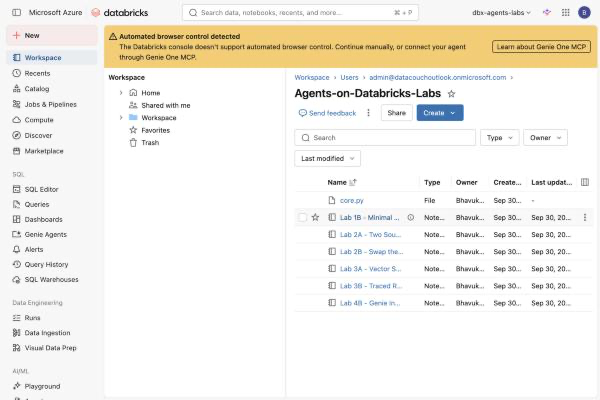
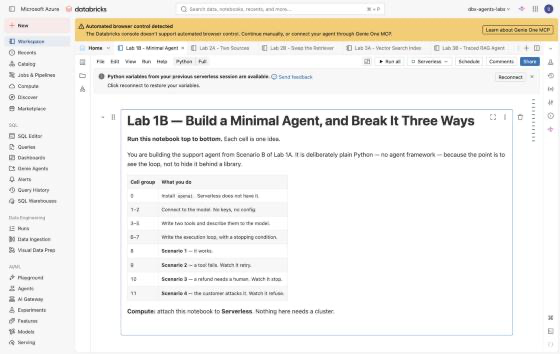

# Lab 2A — An Agent That Needs Two Sources to Answer

**Session:** 2 — Platform-Agnostic Design
**Duration:** ~50 minutes
**Where you work:** a Databricks notebook
**Compute:** Serverless

> **Verified on 2026-09-30** in a live Azure Databricks workspace. Every output in this
> guide comes from a real run of the notebook you are about to open.

---

## 1. Lab Overview & Objectives

[Lab 1B](../session-1-agent-architecture/lab-1b-minimal-agent.md) gave the agent two toy
tools and a Python dictionary of fake orders. Here it gets **real sources** — policy
documents and live order data, both from Unity Catalog.

That it works is not the interesting part. **How the code is arranged** is.

You will write the agent logic into a file that mentions Databricks nowhere, then prove
that claim rather than asserting it. Everything platform-specific goes into *adapters*
behind three small interfaces. [Lab 2B](lab-2b-adapter-swap.md) then swaps one out.

**By the end of this lab you will be able to:**

1. Define a capability as a **Protocol** — a promise about behaviour, with no
   implementation.
2. Keep agent logic free of platform imports, and **verify it with an AST check** rather
   than trusting a comment.
3. Give an agent two sources that answer different kinds of question, and watch it
   sequence them itself.
4. Point at exactly where an access-control rule lives — and notice that it is in one
   adapter, not in the platform.

---

## 2. Files You Will Use

| # | File | Where | What it does |
|---|---|---|---|
| 1 | **`Lab 2A - Two Sources`** | Workspace → `Agents-on-Databricks-Labs` | The lab. **23 cells** — 13 explaining, 10 to run. |
| 2 | [`lab-2a-two-sources.ipynb`](../notebooks/lab-2a-two-sources.ipynb) | this repo, `notebooks/` | The same notebook as a `.ipynb`, **with outputs saved**, so you can read it on GitHub first. |
| 3 | **`core.py`** | *created by cell 3, next to the notebook* | The portable agent logic. **You write it from the notebook**, then inspect it. |

**To open it:** **Workspace** → `Agents-on-Databricks-Labs` → **`Lab 2A - Two Sources`**,
then attach **Serverless**.



**Attach compute.** Use the selector in the notebook toolbar and pick **Serverless**.
Nothing in this lab needs a cluster.



**If it isn't there:** **Workspace** → **⋮** → **Import** → **File** → pick the `.ipynb`.

> 💡 **`core.py` is a real file, not a cell.** Cell 3 uses `%%writefile` to write it to
> disk beside the notebook. That is deliberate: cell 4 then inspects the file's imports,
> which is something you cannot do to a notebook cell. The file boundary is the lesson.

---

## 3. Prerequisites

- **Foundation Model APIs** enabled (`databricks-claude-sonnet-5`).
- **Serverless** compute.
- `SELECT` on `agents_labs.retail.support_docs`, `.orders` and `.customers`.
- [Lab 1B](../session-1-agent-architecture/lab-1b-minimal-agent.md) — you should recognise
  the execution loop.

---

## 4. What You're Building

```
  core.py  — standard library only, no platform imports
  ┌──────────────────────────────────────────────────────────┐
  │  Retriever   "I can find relevant documents."            │
  │  ToolBox     "I can describe my tools and run one."      │
  │  Chat        "I can complete a conversation."            │
  │                                                           │
  │  run(question, chat=, retriever=, tools=) -> answer+used │
  └──────────────────────────────────────────────────────────┘
        ▲               ▲                    ▲
        │               │                    │
  ┌─────┴─────┐  ┌──────┴────────┐  ┌────────┴─────────┐
  │ Databricks│  │ Keyword       │  │ Spark order      │
  │ Chat      │  │ Retriever     │  │ tools            │
  │           │  │ (TF-IDF)      │  │                  │
  │ serving   │  │ audience      │  │ orders JOIN      │
  │ endpoints │  │ filter HERE   │  │ customers        │
  └───────────┘  └───────────────┘  └──────────────────┘
                     adapters — Databricks lives here
```

---

## 5. Step-by-Step Instructions

### Step 1 — Load the documents (5 min)

Run **cell 0** (`%pip install -q openai`, then `restartPython()`), then **cell 1**.

**Expected result:** seven documents, with their audience.

```
7 documents

  DOC-001  customer    Returns and refunds
  DOC-002  agent_only  Lost in transit procedure
  DOC-003  customer    Delivery timescales by region
  ...
  DOC-006  agent_only  Refund authority limits
  DOC-007  customer    Bulk and fit-out orders
```

> 💡 **Note the `audience` column now.** Two of these seven must never reach a customer.
> Nothing in Unity Catalog enforces that — it is a column. Keep watching it.

---

### Step 2 — Write the core, then prove it (12 min)

**Why:** "Portable" is a claim people make about code that is not.

1. Read **cell 2** — the three Protocols. Each is a promise with no implementation.
2. Run **cell 3**. It writes `core.py` next to your notebook. Read it first: the
   execution loop is the same shape as Lab 1B's, plus a `used` record.
3. Run **cell 4** — the verification.

**Expected result:**

```
  imports    : ['__future__', 'json', 'typing']
  NOT stdlib : none
  verdict    : PORTABLE

  grep for platform words:
    databricks   1 hit(s)  line [1]
    openai       0 hit(s)
    spark        0 hit(s)
    dbutils      0 hit(s)
    mlflow       0 hit(s)

  That hit, in full:
    """The portable core. Knows nothing about Databricks, or any model."""

  It is the docstring SAYING it knows nothing about Databricks.
  grep cannot tell a comment from a dependency. The AST check can.
```

> 🚨 **Read that carefully — the grep "fails" and the code is fine.**
>
> The single hit is the docstring *claiming* portability. A text search cannot tell a
> comment from a dependency; parsing the file's imports can.
>
> This is worth ten seconds of your attention because **most "no platform coupling" policies
> are enforced with grep**, in a CI job someone wrote quickly. They produce false positives
> like this one, and — far worse — they miss real coupling that arrives through a
> transitive import. If portability matters to you, check the import graph.

---

### Step 3 — Write the adapters (10 min)

Run **cells 5, 6 and 7**. Each satisfies one Protocol.

| Cell | Adapter | Satisfies | Where Databricks appears |
|---|---|---|---|
| 5 | `DatabricksChat` | `Chat` | `WorkspaceClient`, `/serving-endpoints` |
| 6 | `KeywordRetriever` | `Retriever` | nowhere, actually — pure Python over cell 1's rows |
| 7 | `SparkOrderTools` | `ToolBox` | `spark.sql` against Unity Catalog |

**Expected result from cell 6:**

```
  DOC-003  score=0.3814  Delivery timescales by region
  DOC-001  score=0.1122  Returns and refunds
  DOC-004  score=0.0936  Warranty terms
```

> 💡 **The keyword retriever is deliberately the least "AI" thing that still works** —
> TF-IDF, no embeddings, no index, no network. That choice makes
> [Lab 2B](lab-2b-adapter-swap.md)'s swap a genuine test: the replacement shares *nothing*
> with it except two method signatures.

> 🚨 **Find the `audience` filter in cell 6.** It is this clause:
>
> ```python
> if not aud or d["audience"] == aud
> ```
>
> That one line is the only thing keeping `DOC-002` and `DOC-006` away from customers. It
> lives **in an adapter**, in one code path. Remember where it is — in
> [Lab 7B](../session-7-operations-and-multi-agent/lab-7b-rollout-and-agent-bricks.md) a
> different, perfectly legitimate tool reads the same documents and has no such clause.

---

### Step 4 — Ask a question that needs both sources (12 min)

Run **cells 8 and 9**.

> *"My order ORD-1044 hasn't arrived. How long should it take, and what are my options?"*

Neither source can answer this alone. The **order** knows the destination but not the
delivery window; the **policy** knows regional timescales but nothing about this order.

**Expected result:**

```
  step 1: get_order({"order_id": "ORD-1044"}) -> {"order_id": "ORD-1044",
          "status": "delivered", "item": "standing desk", "units": 5, ...}
  step 1: search_policy('delivery time and late delivery options')
          -> ['DOC-003', 'DOC-001', 'DOC-004']
  step 2: answer
```

> Good news — I checked your order, and ORD-1044 (5 standing desks, shipped to Helsinki
> Works in the Nordics) is actually already marked as **delivered** in our system.
>
> For reference, standard delivery timing to your region (Nordics) is **5–7 working days**,
> since shipments are consolidated at our Hamburg hub before onward transport **[DOC-003]**.

**Three things to point at:**

1. **It called `get_order` first, then searched policy.** That order is not in the code.
   The agent worked out that it needed the region before it could look up a timescale.
2. **The answer is a genuine join across two systems** — a Delta table and a document
   store — in one sentence.
3. **It handled a contradiction gracefully.** The order says `delivered`; the customer says
   it has not arrived. It reported both and offered next steps rather than picking one.

Cell 9 prints the audit record:

```
  retriever : keyword-tfidf
  model     : databricks-claude-sonnet-5
  documents : ['DOC-003', 'DOC-001', 'DOC-004']
  tools     : ['get_order']
```

> 💡 **`used` is a hand-rolled audit trail**, and it is already the most useful thing in the
> return value. [Session 3](../session-3-grounding-and-rag/lab-3b-traced-rag-agent.md)
> replaces it with MLflow traces stored in Unity Catalog — same idea, queryable in SQL.

---

### Step 5 — Break it deliberately (8 min)

Cell 10 lists three experiments. Do the third.

| # | Change | What to look for |
|---|---|---|
| 1 | Ask *"How long do I have to return a chair?"* | does `used['tools']` stay empty? |
| 2 | Ask about **ORD-9999** | does it invent a delivery date? |
| 3 | **Delete the `audience` filter** in cell 6, then ask *"what is the refund approval limit?"* | `DOC-006` reaches the customer |

> 🚨 **Experiment 3 is a preview of a real incident.** Removing one clause in one adapter
> turns a compliant agent into one that discloses an internal refund threshold. Nothing
> errors. Nothing is logged. The answer looks helpful.
>
> Put the clause back, and ask yourself where that rule *should* live so that removing it
> is harder. [Lab 5B](../session-5-tools-and-governance/lab-5b-mcp-and-access-control.md)
> answers that with Unity Catalog grants.

---

## 6. What You Learned

| You saw… | in Step | proof |
|---|---|---|
| A Protocol is a promise with no implementation | 2 | three classes, no method bodies |
| The core depends only on the standard library | 2 | `NOT stdlib: none` |
| A grep-based portability check gives false positives | 2 gotcha | 1 hit, and it is the docstring |
| Adapters are where the platform is allowed to appear | 3 | `WorkspaceClient`, `spark.sql` |
| The `audience` filter lives in one adapter clause | 3, 5 | `d["audience"] == aud` |
| The agent sequenced two sources without being told to | 4 | `get_order` → `search_policy` |
| It joined a Delta table and a document store in one answer | 4 | Nordics + 5–7 days + `[DOC-003]` |
| It reported a contradiction instead of resolving it | 4 | "marked delivered … here are your options" |
| Deleting one clause discloses an internal document | 5 | `DOC-006` reaches the customer |

## 7. What You Hand In

Nothing. Keep the notebook and `core.py` — [Lab 2B](lab-2b-adapter-swap.md) reuses both,
and checks the file's hash to prove it is unchanged.

---

**Next:** [Lab 2B — Swap the Retriever, Change Nothing Else](lab-2b-adapter-swap.md)
