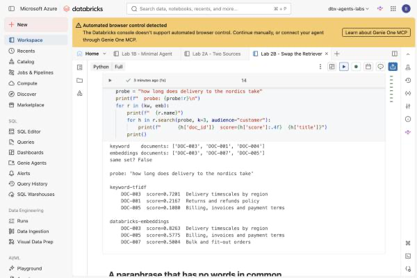
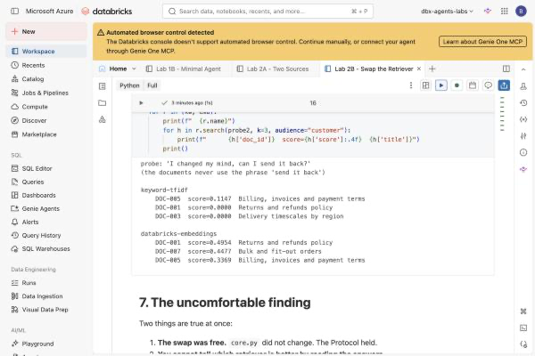
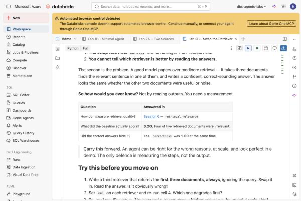

# Lab 2B — Swap the Retriever, Change Nothing Else

**Session:** 2 — Platform-Agnostic Design
**Duration:** ~45 minutes
**Where you work:** a Databricks notebook
**Compute:** Serverless

> **Verified on 2026-09-30.** Every score and document id below is from a real run.

---

## 1. Lab Overview & Objectives

[Lab 2A](lab-2a-retrieval-and-tools.md) claimed `core.py` was portable and checked its
imports. This lab tests that claim the expensive way: **replace an entire adapter** and
see whether the core notices.

Then it asks the harder question — *did the swap make anything better?* The answer is
not what most rooms expect, and it is the reason [Session 6](../session-6-evaluation-and-deployment/lab-6a-evaluation-dataset.md) exists.

**By the end of this lab you will be able to:**

1. Replace one adapter with a structurally unrelated one and change **no** agent code.
2. Explain why comparing two retrievers by reading the agent's answers **does not work**.
3. Show a case where keyword retrieval scores the correct document at **exactly zero**.
4. Explain why relevance scores from different retrievers cannot be compared.

---

## 2. Files You Will Use

| # | File | Where | What it does |
|---|---|---|---|
| 1 | **`Lab 2B - Swap the Retriever`** | Workspace → `Agents-on-Databricks-Labs` | The lab. **17 cells** — 9 explaining, 8 to run. |
| 2 | [`lab-2b-swap-the-retriever.ipynb`](../notebooks/lab-2b-swap-the-retriever.ipynb) | this repo, `notebooks/` | The same notebook with outputs saved. |
| 3 | **`core.py`** | *recreated by cell 2* | The Lab 2A core. The notebook writes it and prints its hash so you can confirm it is byte-identical. |

**To open it:** **Workspace** → `Agents-on-Databricks-Labs` →
**`Lab 2B - Swap the Retriever`**, attach **Serverless**.


**Attach compute.** Use the selector in the notebook toolbar and pick **Serverless**.
Nothing in this lab needs a cluster.


> 💡 **This notebook is standalone.** It rebuilds the Lab 2A setup in cell 1 rather than
> depending on that session still being alive. Cell 2 recreates `core.py` and prints a
> hash — **compare it with the one Lab 2A printed.** If the file changed, the claim "we
> changed nothing" would be worthless.

---

## 3. Prerequisites

- [Lab 2A](lab-2a-retrieval-and-tools.md) completed — you need its hash to compare against.
- **Foundation Model APIs** for both chat (`databricks-claude-sonnet-5`) and embeddings
  (`databricks-gte-large-en`).
- Serverless compute.

---

## 4. What You're Building

```
                       core.py  (unchanged, hash dd0339d663883037)
                              │
              ┌───────────────┴───────────────┐
              │                               │
     ┌────────▼─────────┐           ┌─────────▼────────┐
     │ KeywordRetriever │           │ EmbeddingRetriever│
     │                  │           │                   │
     │ TF-IDF           │           │ gte-large-en      │
     │ matches WORDS    │           │ matches MEANING   │
     │ no network       │           │ 1024-dim vectors  │
     └──────────────────┘           └───────────────────┘
              │                               │
              └───────────────┬───────────────┘
                              │
                 same question, same tools
                              │
                              ▼
              Do the answers differ?    (barely)
              Do the documents differ?  (completely)
```

---

## 5. Step-by-Step Instructions

### Step 1 — Rebuild, and check the hash (8 min)

Run **cell 0** (install), **cell 1** (the Lab 2A setup), then **cell 2**.

**Expected result:**

```
  core.py    : 109 lines
  imports    : ['__future__', 'json', 'typing']
  sha256[:16]: dd0339d663883037
```

**That hash must match the one Lab 2A printed.** If it does, everything that follows is a
fair test.

---

### Step 2 — Write a structurally unrelated retriever (10 min)

Run **cell 3**.

`EmbeddingRetriever` shares **nothing** with `KeywordRetriever` — different algorithm,
different dependencies, one makes network calls and the other does not. The only thing in
common is the two things `core.py` calls:

```python
    search(query, k, **filters) -> list[dict]
    name -> str
```

**Expected result:**

```
  keyword-tfidf              ready
  databricks-embeddings      ready  (7 vectors, dim 1024)
```

---

### Step 3 — The swap (7 min)

Run **cell 4**. One argument changes:

```python
core.run(Q, chat=chat, retriever=kw,  tools=tools)   # before
core.run(Q, chat=chat, retriever=emb, tools=tools)   # after
```

**Expected result** — both work, and both call the tool before searching policy:

```
  KEYWORD
  step 1: get_order({"order_id": "ORD-1044"}) -> {..., "status": "delivered", ...}
  step 1: search_policy('delivery time estimate late delivery options')
          -> ['DOC-003', 'DOC-001', 'DOC-004']
  step 2: answer

  EMBEDDINGS
  step 1: get_order({"order_id": "ORD-1044"}) -> {..., "status": "delivered", ...}
  step 1: search_policy('delivery time estimate and options for delayed orders')
          -> ['DOC-003', 'DOC-007', 'DOC-005']
  step 2: answer

  core.py required no changes.
```

**The Protocol held.** That is the architectural claim of Session 2, demonstrated rather
than asserted.

---

### Step 4 — Compare the answers (5 min)

Run **cell 5** and read both.

**Keyword:**

> Good news — I checked your order, and ORD-1044 (5 standing desks for Helsinki Works) is
> actually already marked as **delivered** … deliveries to the Nordics normally take
> **5–7 working days**, since shipments are consolidated at our Hamburg hub **[DOC-003]**.

**Embeddings:**

> Good news — I checked your order, and ORD-1044 (5 standing desks, placed 2026-09-18 for
> Helsinki Works) is actually already marked as **delivered** … Standard delivery to the
> **Nordics** takes **5–7 working days** … **[DOC-003]**

**Expected result: you cannot rank them.** Both are correct, both cite `DOC-003`, both
spot the contradiction between "delivered" and "hasn't arrived", both offer sensible next
steps.

> 💡 **One faint tell, if you look hard.** The keyword answer wanders into damaged-goods
> returns — *"if any item ever arrives damaged, our standard 30-day return window doesn't
> apply [DOC-001]"* — which nobody asked about. That is `DOC-001` arriving in the context
> and the model finding something to do with it. It is a symptom of weaker retrieval, and
> it presents as **being extra helpful.**

---

### Step 5 — Compare what they *retrieved* (10 min)

Run **cell 6**. Now the difference is stark.



```
  keyword    documents: ['DOC-003', 'DOC-001', 'DOC-004']
  embeddings documents: ['DOC-003', 'DOC-007', 'DOC-005']
  same set? False
```

**Only one of three documents overlapped**, and the answers were indistinguishable.

Now the probe in **cell 7** — a paraphrase using none of the documents' own words:

> *"I changed my mind, can I send it back?"*



```
  keyword-tfidf
      DOC-005  score=0.1147  Billing, invoices and payment terms
      DOC-001  score=0.0000  Returns and refunds policy
      DOC-003  score=0.0000  Delivery timescales by region

  databricks-embeddings
      DOC-001  score=0.4954  Returns and refunds policy
      DOC-007  score=0.4477  Bulk and fit-out orders
      DOC-005  score=0.3369  Billing, invoices and payment terms
```

> 🚨 **Read the keyword column again.** For a returns question it ranks the **billing**
> document first, and scores the actual **Returns and refunds policy at exactly `0.0000`**.
>
> The phrase *"send it back"* shares no tokens with the returns document. TF-IDF has
> nothing to match, so the correct answer scores zero — not low, **zero**. The embedding
> retriever puts it first at `0.4954`.
>
> This is the case keyword retrieval cannot do, and it is not an edge case. It is how
> customers write.

---

### Step 6 — Why you cannot threshold on score (5 min)

Look at the top scores across both probes:

| Probe | keyword top | embeddings top |
|---|---|---|
| *"how long does delivery to the nordics take"* | `0.7201` | `0.8263` |
| *"I changed my mind, can I send it back?"* | `0.1147` | `0.4954` |

> 🚨 **These numbers are not on the same scale and never will be.** TF-IDF cosine and
> embedding cosine measure different things. A relevance floor of `0.3` would discard
> almost everything the keyword retriever ever returns, and almost nothing the embedding
> retriever returns.
>
> [Lab 6B](../session-6-evaluation-and-deployment/lab-6b-optimize-and-deploy.md) tries a
> score floor for real and rejects it — because in that distribution an **irrelevant**
> document scored `0.5522` while a **relevant** one scored `0.5520`.

---

### Step 7 — The uncomfortable finding (5 min)



Read cell 8. Two things are true at once:

1. **The swap was free.** `core.py` never changed. The architecture worked.
2. **You could not tell which retriever was better from the answers.**

The second is the problem this course spends Session 6 on. A capable model papers over
mediocre retrieval: hand it three documents, and it finds the relevant sentence in one of
them and writes a confident, correct answer. The output looks the same whether the other
two were useful or noise.

| Question | Where it is answered |
|---|---|
| How do I *measure* retrieval quality? | [Lab 6A](../session-6-evaluation-and-deployment/lab-6a-evaluation-dataset.md) — the `retrieval_relevance` scorer |
| What did this agent actually score? | **0.20.** Four of every five retrieved documents were irrelevant. |
| Did the correct answers hide it? | Yes — `correctness` was **1.00** at the same time. |

> **Carry this forward.** An agent can be right for the wrong reasons, at scale, and look
> perfect in a demo. Reading outputs will not find it. Measuring the steps will.

---

## 6. What You Learned

| You saw… | in Step | proof |
|---|---|---|
| The core survived a full adapter replacement | 3 | `core.py required no changes` |
| The file was genuinely unchanged | 1 | hash `dd0339d663883037` both labs |
| Two retrievers, different documents, same-quality answers | 4, 5 | 1 of 3 documents overlapped |
| Weak retrieval presents as being *extra helpful* | 4 | unasked-for damaged-goods advice |
| Keyword scored the correct document at **zero** | 5 | `DOC-001 score=0.0000` |
| …and ranked **billing** first for a returns question | 5 | `DOC-005` top |
| Scores from different retrievers are incomparable | 6 | `0.7201` vs `0.8263`, `0.1147` vs `0.4954` |
| You cannot judge retrieval by reading answers | 7 | both answers were good |

## 7. What You Hand In

Nothing. But write down your answer to this before moving on:

> *If you could not tell the difference by reading the answers, how would you ever know
> your retrieval was bad in production?*

[Session 6](../session-6-evaluation-and-deployment/lab-6a-evaluation-dataset.md) is that
answer.

---

**Next:** [Lab 3A — Build a Real Vector Search Index](../session-3-grounding-and-rag/lab-3a-vector-search-index.md)
