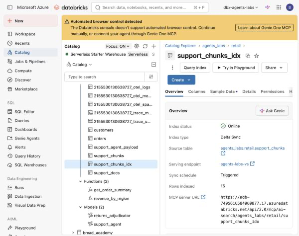

# Lab 3A — Build a Real Vector Search Index

**Session:** 3 — Grounding and RAG
**Duration:** ~50 minutes
**Where you work:** a Databricks notebook
**Compute:** Serverless

> **Verified on 2026-09-30.** Every score and document id below is from a real run.

---

## 1. Lab Overview & Objectives

[Lab 2B](../session-2-platform-agnostic/lab-2b-adapter-swap.md) ended badly on purpose.
Asked *"I changed my mind, can I send it back?"*, the keyword retriever ranked the
**billing** document first and scored the actual returns policy at **`0.0000`** — and you
could not tell from the agent's answer.

This lab replaces it with a managed **Mosaic AI Vector Search** index, then tests it with
questions whose correct answer you already know. *"It feels better"* is not a measurement.

**By the end of this lab you will be able to:**

1. Chunk documents so each chunk **keeps the metadata you need to filter on**.
2. Enable the two table properties a Delta Sync index requires, and say why.
3. Create an index with **managed embeddings** — no embedding code, no vector storage.
4. Test retrieval with known-answer cases instead of impressions.
5. Point at exactly where the `audience` boundary is enforced, and why that is a weak place
   for it to live.

---

## 2. Files You Will Use

| # | File | Where | What it does |
|---|---|---|---|
| 1 | **`Lab 3A - Vector Search Index`** | Workspace → `Agents-on-Databricks-Labs` | The lab. **17 cells** — 9 explaining, 8 to run. |
| 2 | [`lab-3a-vector-search-index.ipynb`](../notebooks/lab-3a-vector-search-index.ipynb) | this repo, `notebooks/` | The same notebook with outputs saved. |

**To open it:** **Workspace** → `Agents-on-Databricks-Labs` →
**`Lab 3A - Vector Search Index`**, attach **Serverless**.


**Attach compute.** Use the selector in the notebook toolbar and pick **Serverless**.
Nothing in this lab needs a cluster.


> 💡 **Cells 3, 4 and 5 are safe to re-run.** They check before they create. If your
> instructor pre-provisioned the endpoint and index — which is normal for a class, because
> an endpoint takes several minutes and is billed — those cells report what exists and move
> on.

---

## 3. Prerequisites

- `SELECT` on `agents_labs.retail.support_docs`, and `CREATE TABLE` in that schema.
- Permission to use (or create) a **Vector Search endpoint**.
- Serverless compute.

---

## 4. What You're Building

```
  support_docs          7 documents
        │
        │  chunk, 3 sentences each, KEEPING metadata
        ▼
  support_chunks       15 chunks
        │               chunk_id · doc_id · title · category · audience · chunk
        │
        │  delta.enableChangeDataFeed = true
        │  PRIMARY KEY (chunk_id)
        ▼
  support_chunks_idx   DELTA_SYNC · TRIGGERED
        │               embedding_source_column = "chunk"
        │               databricks-gte-large-en   (managed — you never embed)
        ▼
  similarity_search(query_text=..., filters={"audience": "customer"})
```

---

## 5. Step-by-Step Instructions

### Step 1 — Chunk, and carry the metadata (10 min)

Run **cell 0** (install), **cell 1**, then **cell 2**.

**Expected result:** 7 documents become 15 chunks.

```
  7 documents -> 15 chunks

  DOC-001-C00  customer    You may return any item within 30 days of delivery for...
  DOC-001-C01  customer    Seating products have an extended 60 day return window...
```

**Why chunk at all?** In Lab 2A the retriever returned whole documents. Fine for seven
short policies, hopeless at real scale — you hand the model 2,000 words to answer what one
sentence covers, and the relevant sentence competes with everything else for attention.

> 🚨 **The chunking is not the interesting part. The metadata is.**
>
> Every chunk keeps its `doc_id`, `title`, `category` and **`audience`**. A chunk that
> loses its `audience` is a chunk you **cannot filter** — and you are then relying on the
> model not to quote it.
>
> This is the most common way a RAG pipeline leaks. The chunker is written first, quickly,
> by someone thinking about token counts.

---

### Step 2 — The two properties Vector Search requires (8 min)

Run **cell 3**.

A Delta Sync index does not read your table once. It **follows** it.

| Requirement | Why |
|---|---|
| `delta.enableChangeDataFeed = true` | so the index sees *what changed*, not the whole table |
| A **primary key** | so a changed row updates in place instead of duplicating |

Databricks refuses to create the index without both, and the error does not always say
which one is missing.

**Expected result:**

```
  agents_labs.retail.support_chunks already exists with 15 rows — leaving it alone

  delta.enableChangeDataFeed = true
  rows                       = 15
```

> ⚠️ **Note what that cell did *not* do.** It found the table already populated and left it
> alone. Rebuilding the source of a live index forces a full re-sync, which for a class of
> thirty people sharing an endpoint is a bad afternoon.

---

### Step 3 — Endpoint and index (12 min)

Run **cells 4 and 5**.

An **endpoint** is the compute that serves indexes; an **index** lives on one. Separately
billed, separately managed, and the endpoint is the expensive half.

```
  endpoint 'agents-labs-vs' already exists
  state: ONLINE

  index 'agents_labs.retail.support_chunks_idx' already exists
  READY   indexed rows: 15
```

**Confirm it in the console** — Catalog Explorer shows the index as a first-class Unity
Catalog object, not a side artifact:



| Field | Value | Why it matters |
|---|---|---|
| Index status | **Online** | it will answer queries |
| Sync schedule | **Triggered** | it syncs when you ask |
| Rows indexed | **15** | if this is 0, the sync has not run — **your first debugging stop** |
| MCP server URL | `.../api/2.0/mcp/ai-search/...` | the index is *already* an MCP tool, which is [Lab 5B](../session-5-tools-and-governance/lab-5b-mcp-and-access-control.md) |

**The line worth understanding** is in the index definition:

```python
embedding_source_column       = "chunk"
embedding_model_endpoint_name = "databricks-gte-large-en"
```

**That is managed embeddings.** You never call an embedding model, never store a vector,
and never write the code that keeps vectors in step with the table.

> 💡 **Compare with Lab 2B's `EmbeddingRetriever`.** It re-embedded all seven documents on
> every single notebook run, and would have gone **silently stale** the moment a document
> changed. It had no idea the table existed. That is the difference between a demo and an
> index.

> 💡 **`TRIGGERED` vs `CONTINUOUS`.** `TRIGGERED` syncs when you ask — cheaper, and you
> control when. `CONTINUOUS` keeps a stream running for lower latency and always-on cost.
> A policy library changes monthly; `TRIGGERED` is right.

---

### Step 4 — Prove it retrieves (12 min)

**This is the cell that matters.** Run **cell 6**.

Four questions, each with a document you already know should come first. That is what makes
it a test rather than a demo.

**Expected result:**

```
  q: How long does delivery to the Nordics take?
     filter=audience:customer   expect top-1=DOC-003   PASS

  q: Can I send it back after six weeks?
     filter=audience:customer   expect top-1=DOC-001   PASS

  q: How much can I refund without asking anyone?
     filter=audience:agent_only   expect top-1=DOC-006   PASS
       DOC-006-C00  DOC-006  agent_only score=0.5973  Refund authority limits
       DOC-006-C01  DOC-006  agent_only score=0.5646  Refund authority limits

  q: What is covered if the chair frame breaks?
     filter=audience:customer   expect top-1=DOC-004   PASS
       DOC-004-C00  DOC-004  customer   score=0.6469  Warranty coverage

  4/4 retrieval checks passed
```

**Case 2 is the one to point at.** *"Can I send it back after six weeks?"* is the paraphrase
that scored **`0.0000`** under keyword retrieval in Lab 2B. It now returns `DOC-001` first.

---

### Step 5 — The filter as a governance boundary (8 min)

Run **cell 7**. Same question, two audiences.

```
  filters={'audience': 'agent_only'}
      DOC-006  agent_only score=0.5973  Refund authority limits

  filters={'audience': 'customer'}
      DOC-001  customer   score=0.4? ...   (nothing about approval limits)
```

`DOC-006` is unreachable as a customer. The question is still asked; the answer is simply
not in the candidate set. **That is the right shape** — you did not ask the model to keep a
secret, you kept the secret out of its context.

---

### Step 6 — Be precise about what protected you (5 min)

Read **cell 8**.

| | |
|---|---|
| What stopped the disclosure | the `filters=` argument, **in the calling code** |
| What did *not* stop it | any grant, policy or property in Unity Catalog |

The index contains `DOC-006`. Every caller with access to the index can read it. The only
thing keeping it from customers is that **this** caller remembered to pass
`filters={"audience": "customer"}`.

> 🚨 **That is a convention, not a control.**
>
> In [Lab 7B](../session-7-operations-and-multi-agent/lab-7b-rollout-and-agent-bricks.md) a
> no-code Agent Bricks assistant is pointed at **this same index**. It has no filter control
> at all, and it quotes `DOC-006` verbatim to a customer-facing chatbot. Nothing was
> misconfigured; a new, legitimate consumer just did not know the rule existed.
>
> The fix is not a better prompt. Put internal content where the customer-facing agent has
> no grant — a **separate index**, or an index built over a **view** filtered to
> `audience = 'customer'`.

---

## 6. What You Learned

| You saw… | in Step | proof |
|---|---|---|
| Chunks must carry the metadata you filter on | 1 | `audience` on every chunk |
| Delta Sync needs CDF **and** a primary key | 2 | both set before the index would build |
| Managed embeddings remove the staleness problem | 3 | no embedding code anywhere |
| Retrieval is tested with known answers | 4 | **4/4 passed** |
| The Lab 2B failure case now works | 4 | `0.0000` → `DOC-001` top-1 |
| Rows indexed is the first debugging stop | 3 | `15` in Catalog Explorer |
| The index is already exposed as an MCP tool | 3 | MCP server URL on the index page |
| The filter keeps internal docs out of the context | 5 | `DOC-006` unreachable as customer |
| …but it lives in the caller, not in a grant | 6 | [7B](../session-7-operations-and-multi-agent/lab-7b-rollout-and-agent-bricks.md) discloses it from this index |

## 7. What You Hand In

Nothing. [Lab 3B](lab-3b-traced-rag-agent.md) uses this index directly.

---

**Next:** [Lab 3B — A RAG Agent Whose Every Step Is Auditable](lab-3b-traced-rag-agent.md)
