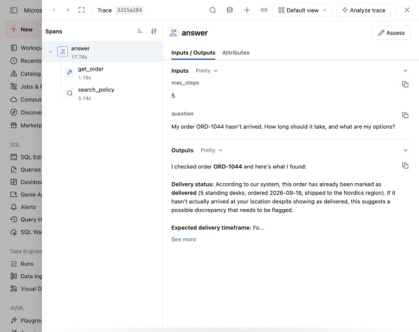
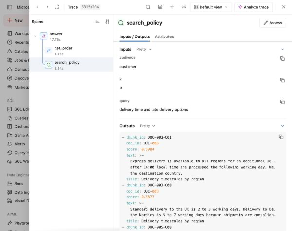

# Lab 3B — A RAG Agent Whose Every Step Is Auditable

**Session:** 3 — Grounding and RAG
**Duration:** ~50 minutes
**Where you work:** a Databricks notebook
**Compute:** Serverless

> **Verified on 2026-09-30.** Every trace, span and timing below is from a real run.

---

## 1. Lab Overview & Objectives

[Lab 2B](../session-2-platform-agnostic/lab-2b-adapter-swap.md) ended on a question:

> *If you cannot tell good retrieval from bad by reading the answer, how would you ever
> know?*

You stop reading answers and start reading **traces** — a record of what each step
received, produced and decided. This lab makes every step of a RAG agent a span, stores
those spans in **Unity Catalog Delta tables**, and then queries them in SQL.

**By the end of this lab you will be able to:**

1. Send MLflow traces to Unity Catalog — and **verify** they went there, because the
   failure mode is silent.
2. Use `span_type` deliberately, and say why `RETRIEVER` in particular matters.
3. Answer *"which chunks produced that sentence?"* without reading any agent code.
4. Query your own traces in SQL to find where the time actually goes.

---

## 2. Files You Will Use

| # | File | Where | What it does |
|---|---|---|---|
| 1 | **`Lab 3B - Traced RAG Agent`** | Workspace → `Agents-on-Databricks-Labs` | The lab. **19 cells** — 10 explaining, 9 to run. |
| 2 | [`lab-3b-traced-rag-agent.ipynb`](../notebooks/lab-3b-traced-rag-agent.ipynb) | this repo, `notebooks/` | The same notebook with outputs saved. |

**To open it:** **Workspace** → `Agents-on-Databricks-Labs` →
**`Lab 3B - Traced RAG Agent`**, attach **Serverless**.


**Attach compute.** Use the selector in the notebook toolbar and pick **Serverless**.
Nothing in this lab needs a cluster.


---

## 3. Prerequisites

- [Lab 3A](lab-3a-vector-search-index.md) — you need `support_chunks_idx`.
- A **SQL warehouse** you can use. UC trace storage needs one to provision and query the
  tables; the notebook finds it for you rather than making you paste an id.
- `CREATE TABLE` in `agents_labs.retail` — MLflow creates the trace tables there.

---

## 4. What You're Building

```
  answer()                      @mlflow.trace(span_type="AGENT")
     ├── search_policy()        @mlflow.trace(span_type="RETRIEVER")
     │      inputs  : query, audience, k
     │      outputs : every chunk, WITH ITS SCORE
     └── get_order()            @mlflow.trace(span_type="TOOL")
            inputs  : order_id
            outputs : the row

                    │
                    ▼   trace_location=UnityCatalog(...)
                    │
     agents_labs.retail.<experiment_id>_otel_spans        ← a Delta table
                        <experiment_id>_otel_logs
                        <experiment_id>_otel_metrics
                        <experiment_id>_otel_annotations
                        <experiment_id>_trace_metadata
                        <experiment_id>_trace_unified
```

---

## 5. Step-by-Step Instructions

### Step 1 — Send traces to Unity Catalog (12 min)

Run **cell 0** (install), then **cell 1**.

> 🚨 **This is the cell people get wrong, and the failure is silent.**
>
> Calling `mlflow.set_experiment(name)` on its own **works**. It also quietly writes traces
> to legacy workspace storage. You find out weeks later, when you go looking for the Delta
> tables and there are none.

Three things are required:

| | |
|---|---|
| `trace_location=UnityCatalog(catalog_name=..., schema_name=...)` | the destination |
| `MLFLOW_TRACING_SQL_WAREHOUSE_ID` | a warehouse to provision and query the tables |
| An **absolute** experiment path | `/Users/you/name`. A bare name is rejected. |

**Expected result:**

```
  warehouse : Serverless Starter Warehouse  (c8729519c456cb8e)
  experiment: /Users/<you>/agents-labs-3b
```

> ⚠️ **First run may sit for a while.** If the warehouse is stopped, MLflow starts it:
> `SQL warehouse 'c87…' is STOPPED; starting it and waiting up to 1200s for RUNNING.`
> That is not a hang. Later runs are immediate.

Now run **cell 2** — the verification:

```
  trace_location type : UnityCatalog
  Unity Catalog? True
  ok — traces will land in Delta tables you can query
```

> 💡 **A trace appearing in the MLflow UI proves the export worked. It does not prove it
> went to Unity Catalog.** That is why this cell asserts rather than prints.

---

### Step 2 — One span per step (10 min)

Run **cells 3 and 4**.

`@mlflow.trace` wraps a function in a span. The `span_type` is **not decoration**:

| Function | `span_type` | What the span records |
|---|---|---|
| `search_policy` | `RETRIEVER` | the query, the filter, every chunk **with its score** |
| `get_order` | `TOOL` | the arguments and the row returned |
| `answer` | `AGENT` | the question in, the answer out |

> 💡 **`RETRIEVER` is the one that earns its keep.** It is what makes MLflow record
> retrieved documents in a form the evaluation scorers in
> [Lab 6A](../session-6-evaluation-and-deployment/lab-6a-evaluation-dataset.md) can read.
> Mark it `TOOL` and `retrieval_relevance` has nothing to score.

---

### Step 3 — Run it, then read the trace (12 min)

Run **cell 5** (the agent), then **cell 6** (the span tree).

**Expected result:**

```
  5 trace(s)

  answer           [AGENT]       13.56s
    get_order        [TOOL]        1.26s
    search_policy    [RETRIEVER]   0.47s
```

> 🚨 **Read those numbers before anything else.** The whole turn took **13.56s**. The tool
> took 1.26s and retrieval took **0.47s** — together, under 13% of it. **The rest is the
> model.**
>
> Teams routinely spend a sprint optimising retrieval latency for an agent whose retrieval
> is half a second. The trace tells you that in one glance, and nothing else does.

**The same trace in the console.** The CLI view is good for scripting; this is what you
will actually open when something goes wrong at 2am, and it reads the *same* UC tables:



---

### Step 4 — The retriever span holds the evidence (8 min)

Run **cell 7**.

```
  query    : delivery time and late delivery options
  audience : customer
  k        : 3

  DOC-003-C01  DOC-003  score=0.5984  Delivery timescales by region
      Express delivery is available to all regions for an additional 18 GBP...
  DOC-003-C00  DOC-003  score=0.5677  Delivery timescales by region
      Standard delivery to the UK is 2 to 3 working days. Delivery to Benelux...
  DOC-005-C00  DOC-005  score=0.5521  Billing, invoices and payment terms
      Standard and plus tier customers are charged at the point of order...
```



**Everything needed to judge grounding is in one place:**

- **The query is the model's, not the user's.** The customer wrote *"My order ORD-1044
  hasn't arrived…"*; the model searched for *"delivery time and late delivery options"*.
  You cannot debug retrieval without seeing that.
- **If a claim in the answer is not in one of these chunks, the model invented it.** No
  reasoning about prompts required.
- **The third result is a billing document on a delivery question.** One of three retrieved
  chunks is noise, and the answer was still correct. **That is the Lab 2B problem, now
  visible.** [Lab 6A](../session-6-evaluation-and-deployment/lab-6a-evaluation-dataset.md)
  measures it at `retrieval_relevance` **0.20**.

> ⚠️ **Note `audience: customer` in the inputs.** That filter is the only thing keeping
> `DOC-002` and `DOC-006` out of this answer — see
> [Lab 3A](lab-3a-vector-search-index.md) Step 6.

---

### Step 5 — Your traces are Delta tables (8 min)

Run **cell 8**.

```
  trace tables for experiment 2155530130638727:
    2155530130638727_otel_annotations
    2155530130638727_otel_logs
    2155530130638727_otel_metrics
    2155530130638727_otel_spans
    2155530130638727_trace_metadata
    2155530130638727_trace_unified
```

Then a real query — where the time goes, across every run:

```sql
SELECT name AS span,
       count(*) AS calls,
       round(avg((end_time_unix_nano - start_time_unix_nano)/1e9), 2) AS avg_s,
       round(max((end_time_unix_nano - start_time_unix_nano)/1e9), 2) AS max_s,
       sum(CASE WHEN status.code = 'STATUS_CODE_ERROR' THEN 1 ELSE 0 END) AS errors
FROM agents_labs.retail.<experiment_id>_otel_spans
GROUP BY name ORDER BY avg_s DESC
```

**This is what the Unity Catalog trace location bought you.** Not a log file — a governed
table you can query, join, aggregate and grant on. *"How often does retrieval return
nothing?"* is a `WHERE`, not a log grep.

> ⚠️ **The schema is OpenTelemetry, not MLflow.** Columns are `name`, `trace_id`,
> `span_id`, `parent_span_id`, `start_time_unix_nano`, `end_time_unix_nano`, `attributes`
> (a `variant`) and `status` (a **struct**, so `status.code`, not `status_code`).
>
> The first draft of this cell failed with
> `[UNRESOLVED_COLUMN.WITH_SUGGESTION] ... cannot be resolved. Did you mean ... status`.
> Run `DESCRIBE` on the table before you guess.

---

## 6. What You Learned

| You saw… | in Step | proof |
|---|---|---|
| Without `trace_location`, traces go to legacy storage **silently** | 1 | the assertion exists for a reason |
| A trace in the UI does not prove UC storage | 1 | `isinstance(loc, UnityCatalog)` |
| A stopped warehouse blocks the first run, not forever | 1 gotcha | `STOPPED; starting it…` |
| `span_type="RETRIEVER"` is what Session 6 scores | 2 | scorers read retrieval from it |
| **87% of the latency was the model** | 3 | 13.56s total, 1.73s in tools |
| The searched query is not the user's question | 4 | *"delivery time and late delivery options"* |
| One of three retrieved chunks was noise | 4 | a billing doc on a delivery question |
| The console reads the same UC tables | 3 | trace detail view |
| Traces are queryable Delta tables | 5 | six tables, one SQL query |
| The trace schema is OpenTelemetry | 5 gotcha | `status.code`, not `status_code` |

## 7. What You Hand In

Nothing. Keep the experiment — [Session 6](../session-6-evaluation-and-deployment/lab-6a-evaluation-dataset.md) evaluates against traces like these.

---

**Next:** [Lab 4A — Build a Genie Space](../session-4-genie/lab-4a-genie-space.md)
