# Lab 4A — Build, Curate and Measure a Genie Agent

**Session:** 4 — Genie
**Duration:** ~60 minutes
**Where you work:** the Databricks console (Genie Agents)
**Writes code:** none — SQL only if you choose to write ground truth by hand

> **UI verified on 2026-09-30** in a live Azure Databricks workspace. Every score,
> assessment and failure message below is from a real benchmark run.

---

## 1. Lab Overview & Objectives

Sessions 2 and 3 grounded an agent in **documents**. This one grounds it in **data**.

Genie turns English into governed SQL. The easy part is getting an answer; the hard part is
knowing whether it is the answer your business meant. This lab does both — and the
measurement comes first, because *"the demo looked good"* is how Genie projects fail.

**By the end of this lab you will be able to:**

1. Create a Genie Agent scoped to specific tables.
2. Write a **benchmark** — a question plus ground-truth SQL that is executed and compared.
3. Read a failing benchmark and say **exactly** why the generated SQL was wrong.
4. Fix it in the **Knowledge Store** — SQL Expressions and General Instructions — rather
   than by rewording the question.
5. Re-run and show the improvement as a number, not an impression.

---

## 2. Files You Will Use

**None.** This lab is entirely in the Databricks console.

| # | What | Where |
|---|---|---|
| 1 | **Genie Agents** | left navigation → **Genie Agents** |
| 2 | `agents_labs.retail.orders` and `.customers` | the two tables your agent will be scoped to |

> ⚠️ **There is no public API for Genie benchmarks.** `GET /api/2.0/genie/spaces/{id}/benchmarks`
> returns `ENDPOINT_NOT_FOUND`, as do the obvious variants. Spaces themselves *are*
> scriptable (`GET /api/2.0/genie/spaces/{id}` works), but **benchmarks and the Knowledge
> Store are console-only** at the time of writing.
>
> That matters for planning: **you cannot put a Genie benchmark in CI yet.** It is a
> curation tool a human runs, not a regression gate.

---

## 3. Prerequisites

- `SELECT` on `agents_labs.retail.orders` and `agents_labs.retail.customers`.
- A running **SQL warehouse** — Genie executes real queries.
- Permission to create a Genie Agent.

---

## 4. What You're Building

```
  Genie Agent "Retail Customer Orders"
  ├── Sources         orders, customers
  ├── Knowledge Store
  │     ├── About         description + common questions
  │     ├── Instructions  general rules, in prose
  │     └── Examples      curated question → SQL pairs
  └── Benchmark
        question + ground-truth SQL
              │
              ▼
        run  →  Genie answers  →  results compared to ground truth
              │
              ├── Bad  → failure analysis → proposed knowledge snippet
              │                                      │
              │                              accept ─┘
              └── Good → you have a number you can defend
```

---

## 5. Step-by-Step Instructions

### Step 1 — Create the agent (10 min)

**Why:** A Genie Agent is scoped to the tables you give it and nothing else. That scoping
is the first governance decision you make, and it is made here.

**1. Open Genie Agents.** In the left navigation, under **SQL**, click **Genie Agents**.

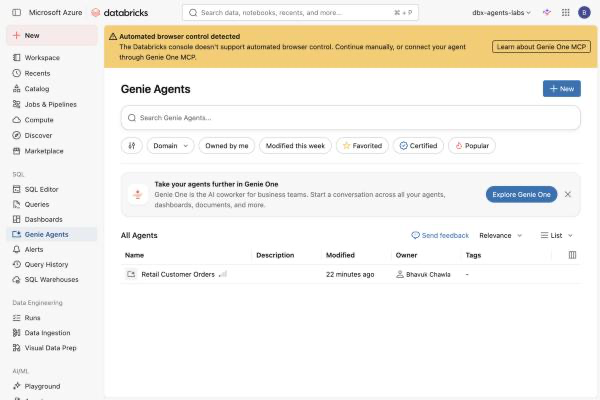

**Expected result:** a list page headed **Genie Agents**, with a **+ New** button at the
top right. If your workspace is fresh the list is empty.

**2. Click + New.** The **Connect your data** dialog opens — *"Genie Agents empower you to
uncover meaningful insights from your data. Just upload your datasets, provide
instructions, and simply ask your data questions."*

**3. Search for your tables.** Type `agents_labs.retail` into the search box.

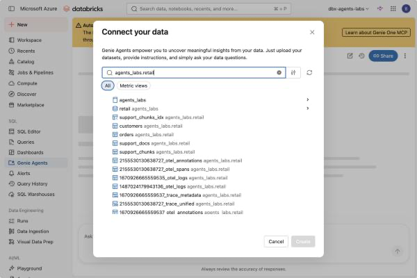

> ⚠️ **Look at everything that came back.** The search returns *every* table in the schema —
> including `support_chunks`, `support_chunks_idx`, and a dozen `…_otel_spans` trace tables
> from [Lab 3B](../session-3-grounding-and-rag/lab-3b-traced-rag-agent.md).
>
> **Do not select them.** A Genie Agent given trace tables will cheerfully answer questions
> about your own observability data, and a business user asking about revenue does not need
> query access to them. **Scope is the first control**, and the picker will not stop you.

**4. Select exactly two tables:** **`customers`** and **`orders`**.

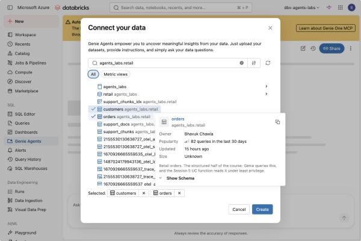

**Expected result:** checkmarks beside both, and a **Selected: customers ✕ orders ✕** row
at the bottom. **Create** becomes enabled.

> 💡 **Hover a table and read the card.** For `orders` it shows the owner, popularity
> (*"82 queries in the last 30 days"*), and — the important one — its Unity Catalog
> **description**:
>
> > *"Retail orders. The structured half of the course: Genie queries this, and the
> > Session 5 UC function reads it under least privilege."*
>
> **That text is the grounding Genie starts from.** It is the table's `COMMENT`, and it is
> the first thing to fix if your agent misunderstands your data. `COMMENT ON TABLE` beats
> prompt engineering, and it benefits every consumer of the table, not just Genie.

**5. Click Create.**

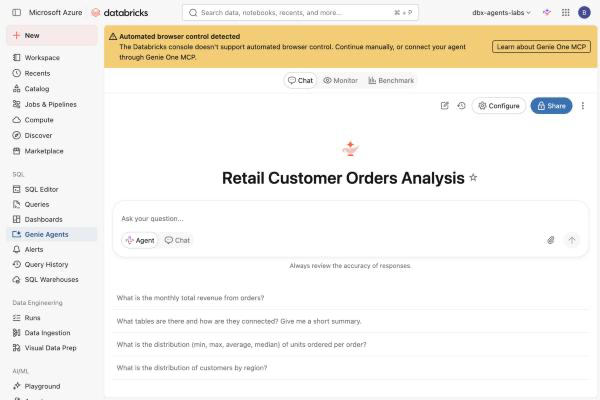

**Expected result:** you land in the new agent's chat page, with four suggested questions
Genie generated by reading your schema — *"What is the monthly total revenue from orders?"*,
*"What is the distribution of customers by region?"* and so on.

> ⚠️ **Genie named the agent for you.** Selecting `customers` and `orders` produced
> **"Retail Customer Orders Analysis"** — it was never typed. Click the title to rename it.
> This lab uses **`Retail Customer Orders`**, and [Lab 4B](lab-4b-genie-in-an-agent.md)
> looks the agent up *by that title*, so if you pick a different name, change
> `SPACE_TITLE` in that notebook to match.

**6. Rename it.** Click the title and type `Retail Customer Orders`.


**Expected result:** the agent is named, scoped to two tables, and ready for a question.
Total elapsed: about two minutes of clicking.

> ⚠️ **Space creation is a UI operation in practice.** `databricks genie create-space`
> exists but takes a `serialized_space` blob whose schema you can only obtain by exporting
> an existing space — probing it returns `Invalid serialized_space: Unknown field 'title'`.
> Create the first one here; script later ones by exporting this one.
>
> Reading a space **is** scriptable: `GET /api/2.0/genie/spaces` returns your agents, which
> is how [Lab 4B](lab-4b-genie-in-an-agent.md) finds this one without a hard-coded id.

---

### Step 2 — Ask a question nobody wrote SQL for (7 min)

In the chat, ask:

> *"Which region had the biggest drop in revenue from August to September 2026?"*

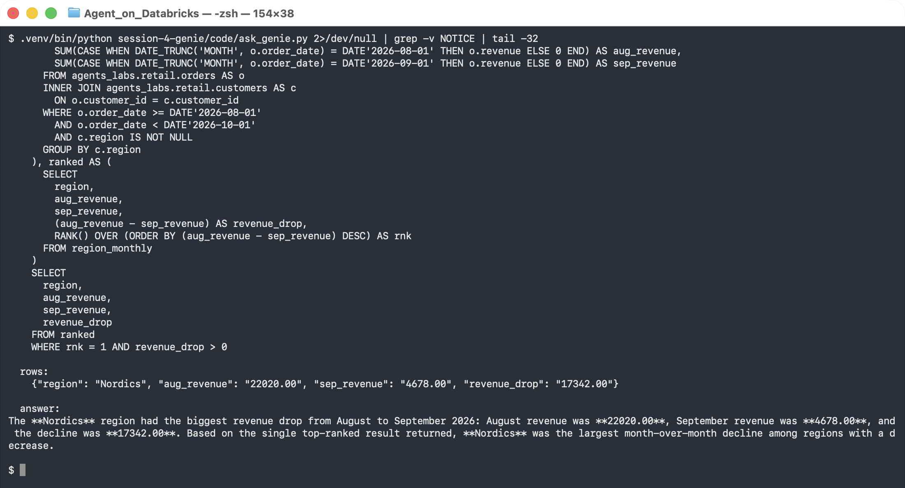

Genie writes a windowed query unprompted — conditional aggregation, a join, `RANK()` — and
answers **Nordics**, August `22020.00` → September `4678.00`.

> 🚨 **Always read the generated SQL.** It is returned alongside the answer for a reason. A
> plausible number computed from the wrong join, the wrong date boundary or a silently
> dropped `NULL` is far more dangerous than an error. Here the `WHERE` uses a half-open
> range `>= '2026-08-01' AND < '2026-10-01'`, which is correct; a `BETWEEN` on a timestamp
> column would have been subtly wrong.
>
> **The SQL is the auditable artifact, not the prose.**

Ask a follow-up and Genie keeps the thread — *"which customer drove that?"*:

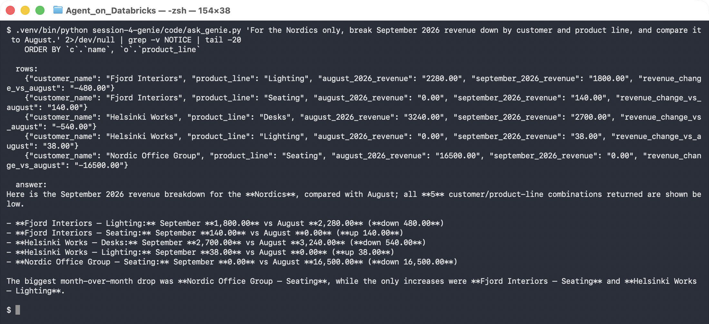

That answer was good. Step 3 is about the ones that are not — and about not finding out
from a customer.

> 💡 **Before you go further, open Configure and look at the Knowledge Store.** Four tabs:
> **About**, **Sources**, **Instructions**, **Examples**. This is the whole surface you get
> to tune, and Genie has already written a suggested description for you to accept or edit.
>
> 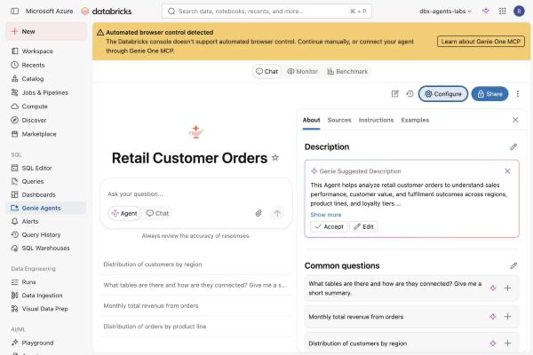

---

### Step 3 — Write a benchmark (12 min)

**Why:** A benchmark is a question plus the SQL you know is right. Genie runs both and
compares the **results**, so this is a real test, not a vibe check.

1. Top of the agent page → **Benchmark** tab.

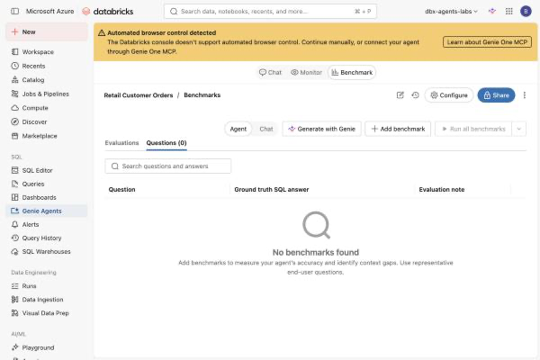

2. **+ Add benchmark**.
3. **Question:**

   ```
   Who are our best customers?
   ```

4. **Ground truth SQL answer:**

   ```sql
   SELECT c.name, SUM(o.revenue) AS lifetime_revenue
   FROM agents_labs.retail.orders o
   JOIN agents_labs.retail.customers c USING (customer_id)
   GROUP BY c.name
   ORDER BY lifetime_revenue DESC
   LIMIT 5
   ```

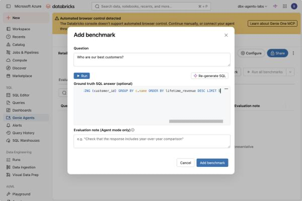

5. **Add benchmark**.

> 💡 **Choose questions that are ambiguous *to a stranger* but obvious to the business.**
> *"Who are our best customers?"* is perfect: by lifetime revenue the answer is Nordic
> Office Group; by order count it is a four-way tie. **You know which one your CFO means.
> Genie does not.** That gap is what the Knowledge Store exists to close.

> ⚠️ **Ground truth is optional, and skipping it costs you the automation.** Without it the
> question is *"marked for manual review"* — still useful for spotting drift, but somebody
> has to read every answer.

---

### Step 4 — Run it, and read the failure (12 min)

Click **▶ Run all benchmarks**. Expect 1–2 minutes per question; Genie generates an answer
and executes both queries.

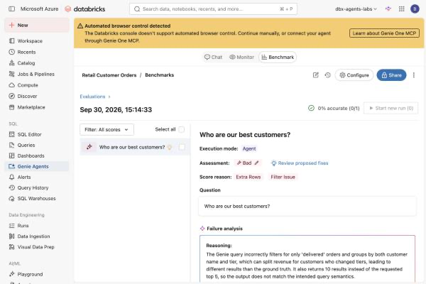

**Expected result — and this is the point of the lab:**

```
  0% accurate (0/1)

  Assessment  : Bad
  Score reason: Extra Rows | Filter Issue

  Failure analysis
  The Genie query incorrectly filters for only 'delivered' orders and groups by
  both customer name and tier, which can split revenue for customers who changed
  tiers, leading to different results than the ground truth. It also returns 10
  results instead of the requested top 5, so the output does not match the
  intended query semantics.
```

**Three distinct faults, named precisely:**

| Fault | Why Genie did it |
|---|---|
| Filtered to `status = 'delivered'` | a reasonable guess nobody told it not to make |
| Grouped by `name` **and** `tier` | `tier` is on the customer; grouping by it splits a customer who changed tier |
| Returned 10 rows, not 5 | *"best customers"* does not say how many |

> 🚨 **Not one of these is a hallucination.** Every choice is defensible in isolation.
> Genie did not invent data — it made three reasonable assumptions, and your business makes
> three different ones. **This is what "wrong" usually looks like in a text-to-SQL system**,
> and no amount of reading the prose answer would have revealed it. The prose said
> *"here are your best customers"* and listed real names.

---

### Step 5 — Let Genie propose the fix (8 min)

Next to the **Bad** assessment, click **✨ Review proposed fixes**.

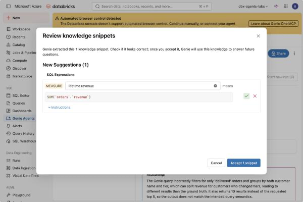

```
  Review knowledge snippets
  Genie extracted this 1 knowledge snippet. Check if it looks correct; once you
  accept it, Genie will use this knowledge to answer future questions.

  New Suggestions (1)   SQL Expressions
    MEASURE  lifetime revenue   means   SUM(`orders`.`revenue`)
```

Click **Accept 1 snippet**.

> 💡 **This is knowledge mining, and it is the loop worth internalising.** A failing
> benchmark produced a reusable definition. You did not write it; you *reviewed* it. The
> definition now applies to every future question that mentions lifetime revenue, not just
> this one.
>
> **Review it properly, though.** Accepting a snippet writes a business definition into
> your agent. A wrong one is worse than none, because now it is confidently wrong
> everywhere.

---

### Step 6 — Write the instructions the snippet did not cover (8 min)

The snippet fixed the *measure*. Two faults remain: the `delivered` filter and the `tier`
grouping. Those are rules, not measures.

**Configure → Instructions.** It starts empty, with a placeholder showing the *kind* of
thing that belongs here:

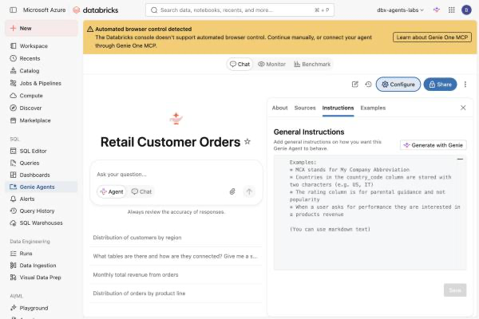

Enter:

```
Revenue is already stored in orders.revenue. Never recompute it from units and price.

"Best customers" and "top customers" mean highest lifetime revenue: the sum of
orders.revenue per customer across all of that customer's orders.

Include orders of every status unless the user explicitly asks for one. Do not
filter to 'delivered' by default.

Tier and region are attributes of the customer, not of the order. Never group a
per-customer total by tier or region unless the user asks for that breakdown.

When the user asks for a top N, return exactly N rows.
```

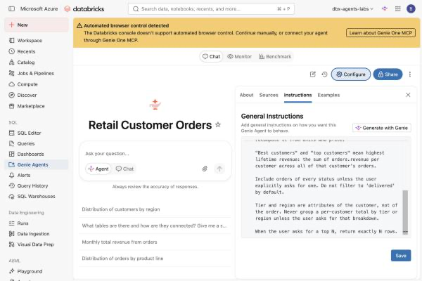

Click **Save**.

> 💡 **Every line there was written against a named failure.** None of it was guessed. That
> is the difference between curation and prompt-fiddling: you are not making the agent
> "better", you are closing three specific gaps the benchmark identified.

> ⚠️ **Instructions are prose, and prose drifts.** There is no test that these are still
> needed, or still correct, six months from now. The benchmark is the only thing that will
> tell you — which is why you wrote it first.

---

### Step 7 — Re-run, and get a number (5 min)

**Benchmark → Run all benchmarks.**

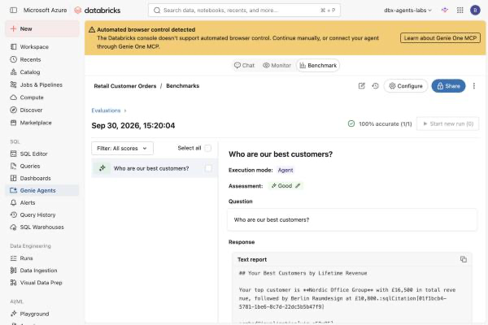

```
  100% accurate (1/1)

  Assessment: Good

  ## Your Best Customers by Lifetime Revenue
  Your top customer is **Nordic Office Group** with £16,500 in total revenue,
  followed by Berlin Raumdesign at £10,800.
```

**The full arc, all of it measured:**

| | Before | After |
|---|---|---|
| Accuracy | **0% (0/1)** | **100% (1/1)** |
| Assessment | Bad | Good |
| Score reason | Extra Rows, Filter Issue | — |
| What changed | *(nothing in the question)* | 1 SQL Expression + 5 lines of instructions |

**The question was never reworded.** That is the discipline: when Genie gets something
wrong, the fix belongs in the Knowledge Store, where it applies to every future phrasing —
not in the question, which helps exactly one person once.

---

### Step 8 — Extend it (optional, 10 min)

Add three more benchmarks and re-run. Suggested, in increasing difficulty:

| Question | Why it is hard |
|---|---|
| *"What is total revenue by region?"* | `region` lives on `customers`, so it needs the join |
| *"What is our average order value?"* | is that `avg(revenue)`, or `sum(revenue)/count(DISTINCT order_id)`? |
| *"Which customers have gone quiet?"* | **undefined.** Watch what Genie invents, then decide whether you want an instruction or a refusal |

> 💡 **The third one is the most valuable.** A benchmark whose correct answer is *"the data
> does not define that"* is worth writing, because it catches an agent that will confidently
> answer anything.

---

## 6. What You Learned

| You saw… | in Step | proof |
|---|---|---|
| Genie writes non-trivial SQL unprompted | 2 | windowed query, correct half-open date range |
| The generated SQL is the auditable artifact | 2 | prose hides join and boundary errors |
| A benchmark executes both queries and compares results | 3 | not a vibe check |
| Ambiguous-to-a-stranger questions expose real gaps | 3 | "best" = revenue or order count? |
| The baseline was **0% accurate** | 4 | Assessment Bad |
| The failure was three reasonable assumptions | 4 | filter, grouping, row count |
| None of it was a hallucination | 4 | every name returned was real |
| A failing benchmark proposes its own fix | 5 | `lifetime revenue` = `SUM(orders.revenue)` |
| Instructions were written against named failures | 6 | five lines, three faults |
| Curation is measured, not asserted | 7 | **0% → 100%** |
| The question was never reworded | 7 | only the Knowledge Store changed |
| Benchmarks are console-only — **no CI** | 2 gotcha | API returns `ENDPOINT_NOT_FOUND` |

## 7. What You Hand In

A screenshot of your benchmark run showing the accuracy figure, plus the Knowledge Store
entries you added. If your number did not move, say what you changed and what the failure
analysis said — **a documented failed attempt is worth more than an undocumented pass.**

---

**Next:** [Lab 4B — Genie Inside an Agent](lab-4b-genie-in-an-agent.md)
