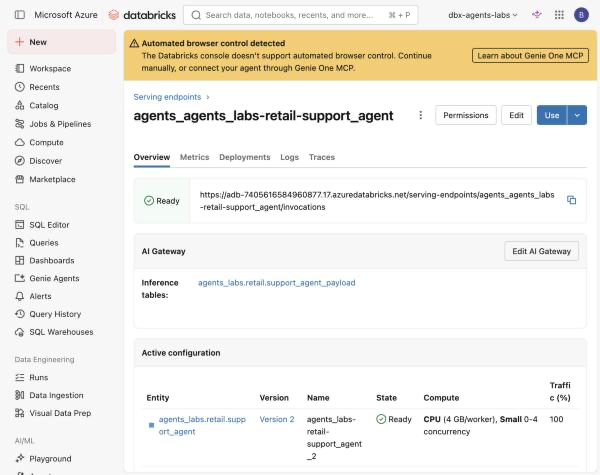
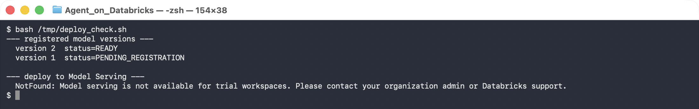

# Lab 6B — Optimize, Re-Evaluate, and Deploy

**Session:** 6 — Evaluation and Deployment
**Duration:** ~60 minutes
**Where you work:** a Databricks notebook
**Compute:** Serverless

> **Verified on 2026-09-30**, including the live endpoint. Every number below is from a
> real run.

---

## 1. Lab Overview & Objectives

[Lab 6A](lab-6a-evaluation-dataset.md) gave you a baseline: **correctness 1.00, retrieval
relevance 0.23.** The agent is right and its retrieval is mostly noise.

Now change one thing and measure again. The headline numbers will move in the direction
you hoped — and you will find that **not one point of that movement came from the agent
being better at its job.**

**By the end of this lab you will be able to:**

1. Reject a tuning lever using evidence rather than instinct.
2. Re-run an evaluation and compare variants.
3. **Segment a metric by case type**, and explain why an unsegmented mean is unusable here.
4. Register an agent in Unity Catalog with its `resources`, deploy it, and query it.

---

## 2. Files You Will Use

| # | File | Where | What it does |
|---|---|---|---|
| 1 | **`Lab 6B - Optimize and Deploy`** | Workspace → `Agents-on-Databricks-Labs` | The lab. **22 cells** — 12 explaining, 10 to run. |
| 2 | [`lab-6b-optimize-and-deploy.ipynb`](../notebooks/lab-6b-optimize-and-deploy.ipynb) | this repo, `notebooks/` | The same notebook with outputs saved. |
| 3 | **`serving_agent.py`** | *written by cell 16* | The `ResponsesAgent` that gets registered. |

**To open it:** **Workspace** → `Agents-on-Databricks-Labs` →
**`Lab 6B - Optimize and Deploy`**, attach **Serverless**.


**Attach compute.** Use the selector in the notebook toolbar and pick **Serverless**.


---

## 3. Prerequisites

- [Lab 6A](lab-6a-evaluation-dataset.md) **must have run** — cell 4 compares against its
  experiment.
- **Premium or Enterprise** for the deployment steps. Everything up to cell 17 runs on a
  trial.

---

## 4. Step-by-Step Instructions

### Step 1 — Reject the obvious lever (10 min)

Run **cells 0–2**.

The standard fix for poor retrieval precision is a **relevance score floor**. Look at the
distribution before reaching for it:

```console
  DOC-003-C00  score=0.7114   relevant
  DOC-003-C01  score=0.5564   relevant
  DOC-005-C00  score=0.5522   IRRELEVANT  (billing doc on a delivery question)
  DOC-001-C00  score=0.5520   relevant
```

> 🚨 **An irrelevant chunk scored `0.5522`; a relevant one scored `0.5520`.** There is no
> threshold that keeps the good one and drops the bad one. A floor at 0.55 would discard a
> relevant chunk and keep the noise.
>
> **"Add a relevance threshold" is the first suggestion in every RAG tuning discussion**,
> and it assumes a separation your distribution has to actually have. Check first.

The lever we *can* justify: retrieve **fewer** chunks. If two of three are noise, ask for
two.

---

### Step 2 — Re-run with k = 2 (12 min)

Run **cells 3–5**. Same seven cases, same six scorers, `RETRIEVAL_K = 2`.

---

### Step 3 — Compare the aggregates (8 min)

Run **cell 6**.

```console
  metric                                    k=3     k=2
  correctness/mean                         1.00    1.00
  follows_expectations/mean                0.71    0.86  better
  relevance_to_query/mean                  1.00    1.00
  retrieval_groundedness/mean              0.60    0.60
  retrieval_relevance/mean                 0.23    0.30  better
  safety/mean                              1.00    1.00
```

Two metrics up, nothing down. **The tempting conclusion is "retrieving less helped, ship
it."**

You cannot justify that from this table. Hold on to `follows_expectations` moving
`0.71 → 0.86` in particular.

---

### Step 4 — Segment, and find out what actually happened (15 min)

Run **cell 7**.

```console
  metric                   segment    baseline k=3     tuned k=2
  retrieval_relevance      positive   26/48 = 0.54     18/24 = 0.75
  retrieval_relevance      negative    0/66 = 0.00      0/38 = 0.00

  follows_expectations     positive   16/16 = 1.00     12/12 = 1.00
  follows_expectations     negative    7/12 = 0.58      4/9  = 0.44
```

**Finding 1 — the tuning worked, where the metric means anything.**
Retrieval precision on positives went **0.54 → 0.75**. The negatives sat at exactly
`0.00` in both variants — **66 and 38 judgements, not one non-zero** — because on a
question the corpus cannot answer, no retrieved chunk can be relevant. That third of your
dataset can never improve and permanently drags the mean down.

**Finding 2 — and this is the one that matters.**
`follows_expectations` is **perfect on positives in both variants: 16/16 and 12/12.**
Every single failure lives in the negative cases — where
[Lab 6A](lab-6a-evaluation-dataset.md) already showed the judge penalising *correct
refusals*.

> 🚨 **The aggregate moved from 0.71 to 0.86, and not one point of that came from the
> agent being better at following instructions.**
>
> It is noise from a segment whose judge you already know to be unreliable.
>
> **This is more dangerous than a metric that misleads downward.** A number moving the way
> you hoped is one nobody re-examines. Had it gone `0.86 → 0.71` someone would have
> investigated. Going up, it gets pasted into a status update as proof the tuning worked.

> ⚠️ **Two honest caveats about these figures.**
>
> **The baseline is polluted.** Its experiment accumulates traces across every run of Lab
> 6A — 48 positive judgements against 24 for the tuned variant. Different denominators make
> a small delta unreliable. Clear the experiment, or compare like with like.
>
> **Token cost was not measured.** `token_usage` came back unpopulated, so "cheaper" is an
> inference from retrieving less, not an observation. **Do not quote a cost saving you did
> not measure.**

---

### Step 5 — Register the agent (8 min)

Run **cells 8–9**. Cell 8 uses `%%writefile` to create `serving_agent.py` — an MLflow
`ResponsesAgent`, the interface Model Serving expects.

The part people omit is `resources`:

```python
resources=[
    DatabricksServingEndpoint(endpoint_name="databricks-claude-sonnet-5"),
    DatabricksServingEndpoint(endpoint_name="databricks-gte-large-en"),
    DatabricksVectorSearchIndex(index_name="agents_labs.retail.support_chunks_idx"),
    DatabricksFunction(function_name="agents_labs.retail.get_order_summary"),
]
```

> ⚠️ **Declaring `resources` is what lets Databricks mint scoped credentials for the
> endpoint.** Omit them and the model registers happily, then fails at serving with
> permission errors — a failure that arrives minutes later and points nowhere useful.

> ⚠️ **UC registration needs `mlflow[databricks]`, not plain `mlflow`.** With the latter it
> fails *after* building the model with *"Unable to import necessary dependencies to access
> model version files in Unity Catalog"*. The `%pip` line in cell 0 already has it.

---

### Step 6 — Deploy and query (10 min)

Run **cells 10–11**.

```console
  Q: How long do I have to return a task chair?
  (6.8s)
  Task chairs are seating products, so you have **60 days** from delivery to return
  them for a full refund, provided the chair is unused and in its original
  packaging [DOC-001].

  Q: What is the refund approval limit before a manager has to sign off?
  (6.0s)
  The policy excerpts provided don't mention a refund approval limit or manager
  sign-off requirement, so I can't answer this question based on the available
  documentation.
```

**The endpoint in the console:**



> 💡 **You got an inference table you did not ask for.** The AI Gateway logs every request
> and response to `agents_labs.retail.support_agent_payload`. That is genuinely useful — a
> production dataset for the next round of [Lab 6A](lab-6a-evaluation-dataset.md)
> evaluation, drawn from real traffic rather than cases you imagined.
>
> It is also a **governed table containing whatever your users typed**, created without an
> explicit decision. Know it exists, check who has `SELECT` on it, and include it in your
> retention planning.

**Two things to take from this.**

**The caller got simpler.** No vector-search client, no OpenAI client, no SDK doing
retrieval. One authenticated `POST`. The endpoint holds the credentials for the model, the
index and the UC function — which is exactly what `resources` bought you.

**It got faster.** ~6s, against 10–25s for the same agent in a notebook. The endpoint keeps
its clients warm; your notebook rebuilds them every call. **Do not read that as "serving
makes agents fast"** — it means local timings are a poor latency baseline.

> 🚨 **Model Serving requires Premium or Enterprise.** On a trial:
>
> ```
> NotFound: Model serving is not available for trial workspaces.
> ```
>
> 
>
> Azure allows **trial → premium only**, never the reverse. Confirm your SKU before
> planning a session around Steps 5 and 6.

---

## 5. What You Learned

| You saw… | in Step | proof |
|---|---|---|
| A score floor needs a distribution that supports one | 1 | irrelevant 0.5522 beats relevant 0.5520 |
| Retrieval precision improved on positives | 4 | **0.54 → 0.75** |
| Negative cases score 0 structurally, forever | 4 | 0/66 and 0/38 |
| `follows_expectations` was already perfect on positives | 4 | 16/16 and 12/12 |
| **The headline gain came from judge noise, not the agent** | 4 | all failures in negatives |
| A metric moving the right way gets less scrutiny | 4 | the reason this matters |
| The baseline sample is polluted | 4 caveat | 48 vs 24 judgements |
| Token cost was **not** measured | 4 caveat | `token_usage` unpopulated |
| `resources` is what makes serving credentials work | 5 | endpoint, index, function |
| The deployed caller needs no client libraries | 6 | one `POST` |
| Local timings are a poor latency baseline | 6 | ~6s served vs 10–25s local |
| The AI Gateway creates an inference table unasked | 6 | `support_agent_payload` |

## 6. What You Hand In

The **segmented** table, not the aggregate — plus one sentence on what you would have
concluded from cell 6 alone. That sentence is the lab.

---

**Next:** [Lab 7A — A Supervisor Delegating to Two Workers](../session-7-operations-and-multi-agent/lab-7a-multi-agent-supervisor.md)
