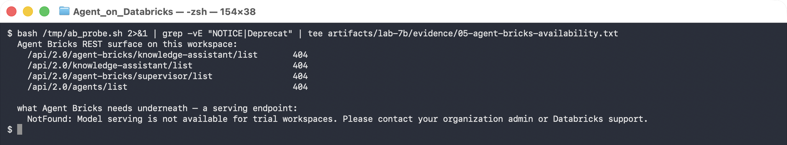
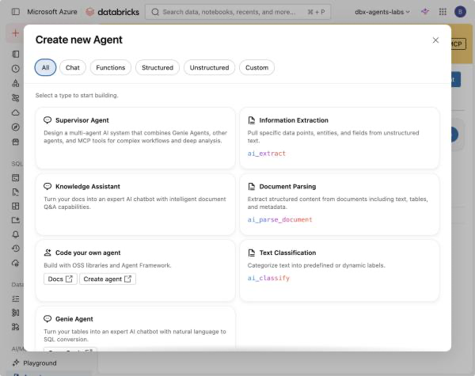
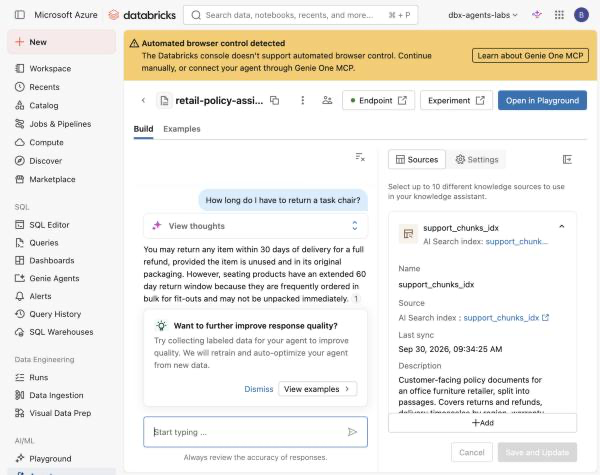
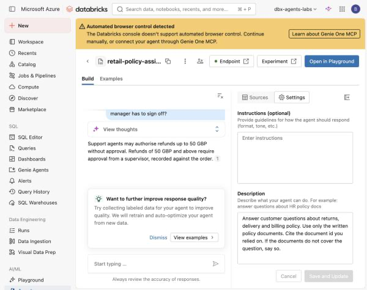

# Lab 7B — Canaries, Safe Rollback, and Agent Bricks

**Session:** 7 — Operations and Multi-Agent Systems
**Duration:** ~70 minutes
**Where you work:** a Databricks notebook (Steps 1–4) and the console (Step 5)
**Compute:** Serverless

> **Verified on 2026-09-30.** Every number and screenshot below is from a real run.

---

## 1. Lab Overview & Objectives

[Lab 6B](../session-6-evaluation-and-deployment/lab-6b-optimize-and-deploy.md) registered a
tuned agent. This lab asks the operational question: **how do you ship a change to it
without finding out from a customer?**

**By the end of this lab you will be able to:**

1. Reference a model by **alias**, never a version number.
2. Canary a candidate against the incumbent, **with a control column**.
3. Explain why a canary needs more than one run — and why `N = 3` cannot rank two variants.
4. Roll back by moving a pointer, and say what must be recorded at promotion time.
5. Say what a no-code Agent Bricks assistant inherits from your index, and what it does not.

---

## 2. Files You Will Use

| # | File | Where | What it does |
|---|---|---|---|
| 1 | **`Lab 7B - Canary and Rollback`** | Workspace → `Agents-on-Databricks-Labs` | Steps 1–4. **14 cells** — 8 explaining, 6 to run. |
| 2 | [`lab-7b-canary-and-rollback.ipynb`](../notebooks/lab-7b-canary-and-rollback.ipynb) | this repo, `notebooks/` | The same notebook with outputs saved. |
| 3 | **`serving_agent_v3.py`** | *written by cell 2* | The loosened-prompt candidate. |

**To open it:** **Workspace** → `Agents-on-Databricks-Labs` →
**`Lab 7B - Canary and Rollback`**, attach **Serverless**.


**Attach compute.** Use the selector in the notebook toolbar and pick **Serverless**.


**Step 5 is in the console**, not the notebook — Agent Bricks has no REST API.

---

## 3. Prerequisites

- [Lab 6B](../session-6-evaluation-and-deployment/lab-6b-optimize-and-deploy.md) — a
  `READY` version of `agents_labs.retail.support_agent`.
- **Premium or Enterprise** for Step 5.

---

## 4. Step-by-Step Instructions

### Step 1 — Register a candidate and name the versions (12 min)

Run **cells 0–3**. Cell 2 writes `serving_agent_v3.py`; the only functional change from
Lab 6B's agent is three lines:

```diff
-SYSTEM = ("You are a support agent … Answer only from the policy excerpts you
-          retrieve. If they do not cover the question, say so. …")
+SYSTEM = ("You are a helpful support agent … Use the policy excerpts you retrieve.
+          Always give the customer a useful, confident answer. …")
```

A realistic change, not a strawman — it is what gets requested after someone reads a week
of refusals in the logs. Retrieval is untouched.

```console
  registered v9
  READY versions: [9, 8, 7, 4, 3, 2]

  @champion   -> v8
  @challenger -> v9

  callers load models:/agents_labs.retail.support_agent@champion and never a version number
```

> 💡 **Note the `READY` filter.** The cell picks the incumbent from versions whose
> `status == "READY"`. This workspace also holds one stuck in `PENDING_REGISTRATION` from
> an earlier failed attempt, and a script naively taking "the highest version below the new
> one" would alias `@champion` to a model that cannot load. **Failed registrations linger
> in the version list forever.**

---

### Step 2 — Canary with two checks (15 min)

Run **cell 4**. Three probes — one answerable, two whose answers live only in `DOC-006`
(`audience: agent_only`).

| Check | Asks |
|---|---|
| **grounding** | did it refuse when it had nothing to cite? |
| **capability** | did it offer to do something it has no tool for? |

The first is what everyone tests. The second is what matters here.

```console
                refusals   promises    words
  champion    2/2        1/3             429
  challenger  1/2        1/3             391
```

> ⚠️ **Gotcha — the first version of this refusal detector reported `0/2` for *both*
> models, and the detector was wrong.**
>
> It was a short substring list: `"couldn't find"`, `"do not cover"`. The agents actually
> said *"don't mention"* and *"wasn't able to find"*. Two correct refusals scored as
> failures.
>
> That is the [Lab 6A](../session-6-evaluation-and-deployment/lab-6a-evaluation-dataset.md)
> lesson again: **a cheap judge fails in the direction of reporting problems that are not
> there.** Feed any automated check text you have read yourself before you trust it.

---

### Step 3 — Run it again. And again. (15 min)

Run **cell 5**. One probe, three times per alias.

```console
  champion    run 1   … answered  PROMISES "escalate this to"
  champion    run 2   … answered  clean
  champion    run 3   … answered  PROMISES "escalate this for"

  challenger  run 1   … answered  clean
  challenger  run 2   … answered  clean
  challenger  run 3   … answered  PROMISES "escalate this to"

               capability claims   mean words
  champion    2/3                          165
  challenger  1/3                          180
```

**The canary found a real defect.** The agent offers to *"escalate this to"* a team it
cannot reach. It has exactly two capabilities — retrieve policy text, look up an order.
Escalation is not one of them, and a customer told *"I've escalated this"* by an agent that
did nothing is worse off than one that was refused.

> 🚨 **But read the champion column. This is not a regression — the incumbent does it too,
> more often this run.**
>
> The prompt change did not cause it. Both variants do it, at rates that swap places
> between runs.
>
> **This is what the control column is for.** A canary running only the challenger would
> have reported the escalation promise, blamed the prompt change, and reverted it —
> leaving the defect shipped and the improvement lost.

> ⚠️ **And the rates are unstable.** An earlier build of this course measured champion
> `0/3` and challenger `2/3` — the **opposite ordering**. Three runs tells you the
> behaviour **exists**; nothing reliable about which variant is worse.
>
> If a behaviour appears in a third of runs, it appears in a third of customer
> conversations. Set `N = 10` for a number you could defend, and treat any ordering from
> `N = 3` as noise.

> 💡 **No groundedness scorer would catch this.** *"I can escalate this for you"* contains
> no factual claim to be ungrounded. It is a **capability** claim, and you have to test for
> it deliberately.

---

### Step 4 — Promote, then roll back (10 min)

Run **cell 6**.

```console
  before                after promote          after rollback
    @champion   -> v8     @champion   -> v9      @champion   -> v8
    @challenger -> v9     @challenger -> v9      @challenger -> v9
    @previous   -> v7     @previous   -> v8      @previous   -> v8

  caller URI, unchanged throughout: models:/agents_labs.retail.support_agent@champion
```

**The caller URI never changed.** Every consumer loads `@champion`. Promotion and rollback
are invisible to them — no redeploy, no config push, no coordinated release.

**`@previous` is written at promotion time, not at rollback time.** This is the part teams
skip. If you only set `@champion`, then at 02:00 during an incident "roll back" means
"find out what was running before", and the answer lives in someone's memory:

```python
if ch:
    c.set_registered_model_alias(UC_MODEL, "previous", ch)
c.set_registered_model_alias(UC_MODEL, "champion", cl)
```

**`@challenger` still points at the candidate.** The prompt change was well motivated.
Keeping it aliased means the next attempt starts from a named artefact with a canary record
attached.

> 💡 **Aliases are Unity Catalog objects**, so who moved `@champion` and when is in the
> audit log. That is the practical difference between an alias and a config file in a repo.

---

### Step 5 — Agent Bricks, and what it does not inherit (20 min)

**Goal:** build the same capability the no-code way, and find out what you gave up.

Agent Bricks turns a document source into a Q&A agent from a form. It needs a **Premium or Enterprise** workspace: on a trial the nav entry is present but the page does not resolve, and the API surface returns 404 for every route.




```console
  Agent Bricks REST surface on a trial workspace:
    /api/2.0/agent-bricks/knowledge-assistant/list       404
    /api/2.0/knowledge-assistant/list                    404
    /api/2.0/agent-bricks/supervisor/list                404
    /api/2.0/agents/list                                 404

  what Agent Bricks needs underneath — a serving endpoint:
    NotFound: Model serving is not available for trial workspaces.
```

There is also **no REST API even on Premium** — those routes 404 regardless. Agent Bricks is configured in the console, which is why this step is a UI walkthrough rather than a script.

> 💡 **A nav entry is not a feature.** The link renders from static navigation, not from what the workspace has provisioned. Open the page before planning a session around it.

On Premium, **Agents → Create Agent** offers the full brick catalog:



Two of these map directly onto what you have already built by hand: **Knowledge Assistant** is Lab 3B, and **Supervisor Agent** is Lab 7A.

### Build the Knowledge Assistant on the index you already have

Choose **Knowledge Assistant**, then set the knowledge source **Type** to **AI Search index** and point it at the Lab 3A index. You are not re-ingesting anything — the brick sits on the same `support_chunks_idx`.


| Field | Value |
|---|---|
| Type | AI Search index |
| Source | `agents_labs.retail.support_chunks_idx` |
| Doc URI Column | `doc_id` — this is what citations resolve to |
| Text Column | `chunk` — the text actually retrieved |
| Describe the content | prose describing what is in the source |

> 💡 **"Describe the content" is the brick's grounding, exactly like a Genie `COMMENT`.** It is how the agent decides *when* this source is relevant. The same lesson as [Lab 4A](../session-4-genie/lab-4a-genie-space.md): the quality of your description is part of the system, not documentation about it.

Ask it the Step 2 probe and it is correct:



> You may return any item within 30 days of delivery for a full refund, provided the item is unused and in its original packaging. However, seating products have an extended **60 day** return window because they are frequently ordered in bulk for fit-outs and may not be unpacked immediately.

That matches the deployed hand-built agent from [Lab 6B](../session-6-evaluation-and-deployment/lab-6b-optimize-and-deploy.md) Step 5. **No code, minutes of work, and a correct answer.**

### Now ask it the ungrounded question

This is the probe from Step 2 — the one whose answer exists only in `DOC-006`, a document tagged `audience: agent_only`.


```console
  Q: What is the refund approval limit before a manager has to sign off?

  Knowledge Assistant:
    Support agents may authorise refunds up to 50 GBP without approval. Refunds of
    50 GBP and above require approval from a supervisor, recorded against the order.
```

That is `DOC-006-C00` **verbatim**, in a customer-facing assistant. Verify what it just disclosed:

```sql
SELECT doc_id, title, audience FROM agents_labs.retail.support_docs
WHERE audience = 'agent_only';
```

```console
  DOC-002 | Lost in transit procedure | agent_only
  DOC-006 | Refund authority limits   | agent_only
```

The deployed hand-built agent, same question, same index, same moment:

```console
  The policy excerpts provided don't mention a refund approval limit or manager
  sign-off requirement, so I can't answer this question based on the available
  documentation.
```

> 🚨 **The difference is one line of code that the brick has nowhere to put.**
>
> The hand-built retriever passes a metadata filter:
>
> ```python
> ix.similarity_search(query_text=q, num_results=k,
>                      filters={"audience": "customer"})   # <- this
> ```
>
> The Knowledge Assistant's entire configuration surface is **Instructions** and **Description**:
>
> 
>
> There is no metadata-filter control. The brick queries the whole index.

**Why this matters beyond Agent Bricks.** The access control was never really access control. It was a **query-time filter**, enforced by the caller, in one code path. That works exactly as long as every caller remembers to apply it — and the moment a second consumer is pointed at the same index, it is gone. Nothing was misconfigured here and nothing was bypassed; a new, legitimate client simply did not know the rule existed.

**Where the boundary belongs.** If `agent_only` content must not reach customers, it must not be *retrievable* by the customer-facing agent:

- index only customer-facing chunks, and keep internal content in a **separate index** the customer-facing agent has no grant on; or
- build the index over a **view** filtered to `audience = 'customer'`, and grant on the view.

Either way the rule lives in Unity Catalog, where [Lab 5B](../session-5-tools-and-governance/lab-5b-mcp-and-access-control.md) put it, and a new consumer inherits it instead of having to re-implement it. **A filter in application code is a convention. A grant is a control.**

> ⚠️ **Writing the rule into Instructions is not a fix.** You could add *"never disclose internal approval thresholds"* to the Instructions box. That is a request to a model, evaluated per response, and Step 3 of this lab already measured how reliable per-response behaviour is: **2 times in 3**. A control you can measure at 67% is not a control.

### What Agent Bricks is and is not

| | Agent Bricks | What you built by hand |
|---|---|---|
| Authoring | a form, minutes | Python, explicit tool schemas |
| Retrieval source | the same UC index | the same UC index |
| Metadata filtering | **not exposed** | `filters={"audience": "customer"}` |
| Supervisor pattern | **Supervisor Agent** brick | `supervisor.py` and a `delegate` tool |
| Quality loop | built in, offers to auto-optimize | Lab 6A dataset + `mlflow.genai.evaluate()` |
| Rollout | managed endpoint versions | the UC aliases in Step 4 |
| Ceiling | the brick's configuration surface | anything you can write |

Agent Bricks is a genuinely good way to get a grounded assistant standing up fast, and for an index whose whole contents are safe for the audience it serves, the trade is excellent. The question to ask before using it is not "is it good enough?" but **"does every constraint I rely on live somewhere the brick can see?"** Here, one did not.

> ⚠️ **What Agent Bricks does not remove.** Its quality loop scores grounding. It does not know your agent has no escalation tool, so it will not flag the capability claim from Step 2, and it evaluates a candidate once, so it will not see the 2-in-3 regression from Step 3. It removes the authoring work, not the work of deciding what "worse" means for your agent and measuring it more than once.

**Region availability** is per-region and changes. Knowledge Assistant and Supervisor Agent were both available in `eastus` at the time of writing.

---

### Step 6 — Leave the aliases in a sane state (3 min)

Re-run **cell 6** and confirm `@champion` points at the version you want serving. The
capstone assumes a working `@champion`. The model and its aliases are removed with the catalog at course end — see [`TEARDOWN.md`](../TEARDOWN.md).

---

## 5. What You Learned

| You saw… | in Step | proof |
|---|---|---|
| Callers reference an alias, never a version | 1, 4 | one URI across promote and rollback |
| Failed registrations linger in the version list | 1 | one stuck `PENDING_REGISTRATION` |
| A narrow refusal detector invented a regression | 2 gotcha | `0/2` for two correct refusals |
| The agent promises a capability it does not have | 3 | *"escalate this to"* |
| No groundedness scorer catches that | 3 | no factual claim to be ungrounded |
| **The incumbent does it too — it is not a regression** | 3 | champion 2/3 vs challenger 1/3 |
| The control column is what tells you that | 3 | challenger-only would have blamed the change |
| Three runs cannot rank two variants | 3 | an earlier build measured 0/3 vs 2/3 |
| Rollback needs `@previous` written at promote time | 4 | `@previous -> v8` |
| Aliases are governed UC objects | 4 | audit log records who moved them |
| The Agents nav entry exists but the page does not, on trial | 5 | `/ml/bricks` → Page not found |
| A brick on the same index answers the grounded probe | 5 | the 60-day seating window |
| It **disclosed an `agent_only` document** | 5 | `DOC-006-C00` quoted verbatim |
| The brick exposes no metadata filter | 5 | Settings is Instructions + Description |
| A query-time filter is a convention, not a control | 5 | a second consumer did not inherit it |

## 6. What You Hand In

The **repeat** table from cell 5, with both columns. Then one sentence: *what would you have concluded if the champion column had not been there?*

## Evidence

- [`artifacts/lab-7b/evidence/01-register-and-alias.txt`](../artifacts/lab-7b/evidence/01-register-and-alias.txt) — registration and initial aliases.
- [`artifacts/lab-7b/evidence/02-canary.txt`](../artifacts/lab-7b/evidence/02-canary.txt) — all six answers in full.
- [`artifacts/lab-7b/evidence/03-canary-repeat.txt`](../artifacts/lab-7b/evidence/03-canary-repeat.txt) — an **earlier** build's repeat, measuring champion `0/3` and challenger `2/3`. Compare it with your own run: the ordering is not stable, which is Step 3's point.
- [`artifacts/lab-7b/evidence/04-promote-rollback.txt`](../artifacts/lab-7b/evidence/04-promote-rollback.txt) — alias state at each stage.
- [`artifacts/lab-7b/evidence/05-agent-bricks-availability.txt`](../artifacts/lab-7b/evidence/05-agent-bricks-availability.txt) — the API and serving probes on the trial workspace.
- [`artifacts/lab-7b/evidence/06-agent-bricks-tested.txt`](../artifacts/lab-7b/evidence/06-agent-bricks-tested.txt) — the Knowledge Assistant configuration, both probes, and the SQL confirming the disclosed chunk is `agent_only`.

Source: [`notebooks/lab-7b-canary-and-rollback.ipynb`](../notebooks/lab-7b-canary-and-rollback.ipynb).

---

**Next:** [Capstone — Build and Defend Your Own Agent](../capstone/capstone-brief.md)
